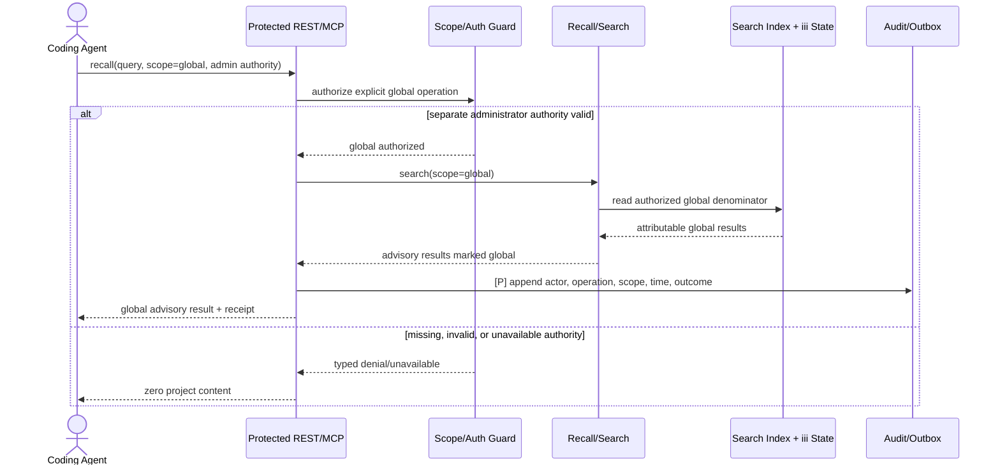
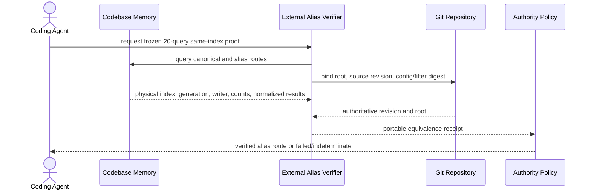
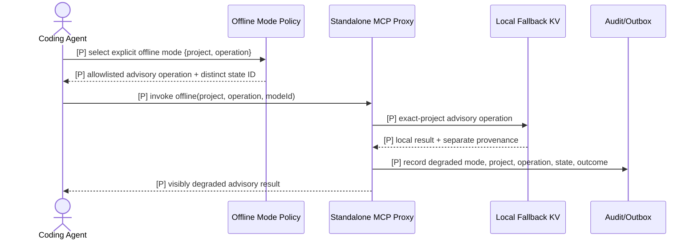
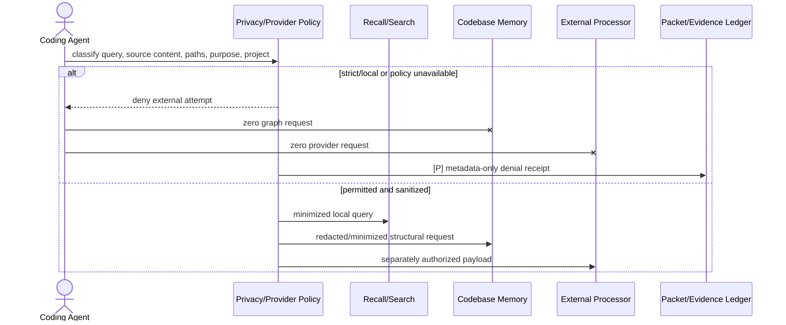

# DES-UCR-001: Scoped Recall and Structural Verification

## Metadata

- ID: `DES-UCR-001`
- Parent use case: `UC-001`
- Iteration: AIWG SDLC Iteration 4
- Owner: Software Architect, subject to the human authority assignments below
- Author role: Documentation Synthesizer (advisory)
- Contributors: Architecture Designer draft; independent Domain/Requirements,
  Security, and Test reviews
- Review dispositions:
  - Domain/Requirements: `CONDITIONAL`
  - Security: `BLOCKED`
  - Test: `BLOCKED`
- Status: **REVIEW CANDIDATE - BLOCKED - HUMAN ACCEPTANCE REQUIRED**
- Dates: created `2026-07-26` / synthesized `2026-07-26`
- Product source baseline reviewed:
  `0e9af82dcfdf07dd1f521c4621823f31a9b2eaba`
- Output scope: this file only
- Canonical traceability authority:
  `.aiwg/requirements/traceability-matrix.md`
- Provider route telemetry directly exposed for this synthesis:
  - configured worker: `.codex/agents/aiwg-model-reasoning-worker.toml`
  - configured model/effort: `gpt-5.6-sol` / `high`
  - provider-observed model/effort: unavailable
  - requested route surface: `subagent` / `thread_spawn`
  - thread: `019f9f0b-840f-7693-9ebf-0bf10563cf5d`
  - provider sandbox label: `seatbelt`
  - assessment: configured pin only; actual model/effort remains unresolved
    without provider-issued telemetry

## Governance and Decision Boundary

This realization is a blocked review candidate. It does not:

- record human acceptance of this realization or its requirements;
- change any ADR from `Proposed`;
- pass ABM or replace the recorded ABM FAIL / NO-GO;
- authorize Construction, deployment, distribution, canary use, or rollout;
- change, mitigate, accept, or retire any risk;
- establish a deterministic test profile or tokenizer;
- authorize Codebase Memory aliasing or duplicate-index retirement; or
- update canonical traceability.

Human acceptance, ADR acceptance, ABM PASS, Construction authorization, risk
disposition, release authorization, and rollout authorization are separate
decisions. None is present.

## DEC-15 and DEC-16 Application

The
[Iteration 4 local macOS disposition](../../reports/iteration-4-local-macos-human-disposition-2026-07-28.md)
records **CRD-01 Option A selected** as DEC-15 and **CRD-02 Option A selected**
as DEC-16.

- DEC-15 permits the exact parent path
  [UC-001](../use-case-briefs/UC-001-scoped-recall.md), this realization, and
  the canonical [Requirements Traceability Matrix](../traceability-matrix.md)
  to satisfy Elaboration bidirectionality when the documentary chain is
  independently graph-verified. Live source and test annotations remain
  Construction work. This propagation does not claim that verification or
  accept the links.
- DEC-16 fixes the complete significant-use-case denominator at
  `DES-UCR-001..003`, tailors MIC and PSC out, and requires this realization
  independently to satisfy at least 19 of the following 23 frozen binary
  behavioral units:

```text
TS-UCR-001, TS-UCR-002, TS-UCR-003, TS-UCR-004, TS-UCR-005,
TS-UCR-006, TS-UCR-007, TS-UCR-008, TS-UCR-009, TS-UCR-010,
TS-UCR-011, TS-UCR-012, TS-UCR-013, TS-UCR-014, TS-UCR-015,
TS-UCR-016, TS-UCR-017, TS-UCR-018, TS-UCR-019, TS-UCR-020,
TS-UCR-021, TS-UCR-022, TS-UCR-023
```

The threshold is `ceil(0.80 * 23) = 19`. A unit scores `1` only when an
independent review confirms its explicit behavioral contract, requirement
link, expected result, forbidden result or side effect, and evidence target;
otherwise it scores `0`. Presence in this file is not a pass. No unit or this
realization is accepted by the selection or this propagation, and no Stage A,
ABM, or Construction status follows.

The generic realization workflow's auto-approval and separate
`traceability-index.md` behavior are overridden by `WORKSPACE.md` and this
assignment. No supplementary traceability index is created. The orchestrator
may later reconcile this artifact into the canonical traceability matrix under
separate authority.

## Evidence Precedence and Classification

This realization keeps normative authority separate from implementation
evidence:

1. **Normative authority:** human-accepted policy and ADRs define what the
   system must do. No such accepted Agentmemory architecture record exists
   yet, so every current ADR remains a proposed constraint only.
2. **Implementation evidence:** live Agentmemory source, directly observed
   runtime behavior, current tests, immutable receipts, Git identities, and
   repository facts determine what the candidate actually does. Test and
   receipt claims remain bounded by the operation and profile exercised.
3. **Structural navigation:** Codebase Memory may locate and relate source,
   but exact live source and execution evidence confirm implementation claims.
4. **Advisory context:** recalled memory, generated summaries, drafts, and
   review prose are hints only.

When accepted normative authority and live implementation conflict, the
authority is not silently overwritten and the implementation is not described
as conforming. The conflict is recorded as nonconformance requiring evidence
and an accountable decision. No recalled or generated statement may overrule
either accepted authority or conflicting live evidence.

| Marker | Meaning |
|---|---|
| **[I]** | Implemented in a current, runtime-wired Agentmemory path. A related test is named only when it exercises the stated behavior. |
| **[X]** | External actor, authority, repository, test runner, provider, or Codebase Memory participant. This is not Agentmemory product implementation. |
| **[P]** | Proposed contract from a Draft requirement, Draft architecture, Proposed ADR, or this realization. It is not established runtime behavior. |
| **[G]** | Evidence, fixture, human policy, implementation, or complete denominator is unresolved. |

Codebase Memory graph results are best-effort navigation evidence. The selected
index reported matching metadata and no recorded coverage issue for the cited
Agentmemory source paths, but that signal is not proof of completeness. Exact
source remains controlling for implementation observations.

## Traceability

### Governing requirements

- Identity and Agentmemory alias migration:
  `FR-01.a`–`FR-01.e`, `FR-02.a`–`FR-02.d`
- Scope and global authority:
  `FR-03.b`–`FR-03.d`
- Eligibility, budget, acknowledgement, and retry:
  `FR-09.a`–`FR-09.g`
- Temporal and dirty/committed provenance:
  `FR-10.a`–`FR-10.d`
- Generation, dispatch, acknowledgement, and suppression:
  `FR-11.a`–`FR-11.e`
- Independent evidence and anti-self-reinforcement:
  `FR-13.a`–`FR-13.e`
- Strict/local privacy and protected authentication:
  `FR-15.a`, `FR-15.b`, `FR-15.d`, `FR-15.e`, `FR-15.f`, `FR-15.g`,
  `FR-15.h`,
  `FR-16.b`
- Required-backend and proxy downgrade behavior:
  `FR-19.b`–`FR-19.e`
- Local readiness and lifecycle prerequisites:
  `FR-20.l`, `FR-21.a`–`FR-21.g`
- Quality:
  `NFR-01.a`, `NFR-02.a`, `NFR-03.a`, `NFR-08.a`,
  `NFR-10.a`, `NFR-10.b`, `NFR-12.a`, `NFR-12.b`

### Architecture and interface controls

- Draft SAD: sections 1–7 and 9–11
- Architecture evolution iteration 4: sections 3–7 and 9–10
- Interfaces:
  `ICM-01`, `ICM-02`, `ICM-05`, `ICM-06`, `ICM-07`, `ICM-08`,
  `ICM-09`, `ICM-10`, `ICM-13`, `ICM-15`, `ICM-16`, `ICM-19`
- Canonical trace IDs:
  `TR-UCM-001`, `TR-UCM-002`, `TR-UCM-005`, `TR-UCM-006`,
  `TR-UCM-007`, `TR-UCM-008`, `TR-UCM-009`, `TR-UCM-010`,
  `TR-UCM-013`, `TR-UCM-015`, `TR-UCM-016`, `TR-UCM-019`

### Risks

`R-01`, `R-02`, `R-03`, `R-04`, `R-05`, `R-06`, `R-10`, `R-13`,
`R-14`, `R-15`, `R-16`, `R-17`, and `R-18`.

Every risk remains `IDENTIFIED`. In particular, R-18 is a P1 risk with a
specification-candidate case card; no execution evidence has been admitted.

### Proposed ADR constraints

All seven ADRs remain `Proposed` and supply candidate constraints only:

| ADR | Candidate constraint used here |
|---|---|
| ADR-001 | Canonical credential-free identity, owner-proven aliases, fail-closed project scope, and separate global authority |
| ADR-002 | Eligibility before relevance, identifiers as locators, independent evidence, and delivery-state separation |
| ADR-003 | Strict/local policy before each boundary, required-backend denial, and truthful degradation |
| ADR-004 | One canonical Codebase Memory index and verified same-index aliasing before consumer cutover |
| ADR-005 | Strict core remains the authority; any compatibility mode is isolated, bounded, expiry-bound, and denied global/gate-critical authority |
| ADR-006 | Immutable generation activation and transactional evidence for migration, rollback, and receipts |
| ADR-007 | Local macOS immutable package, owned LaunchAgent, loopback/authentication boundary, independent processing mode, coordinated runtime/data activation, and isolated normal/canary/rollback instances |

No ADR currently supplies accepted architecture authority.

## Use Case Summary

- Use case: `UC-001 — Scoped Recall and Structural Verification`
- Primary actor: coding agent acting for a coding client
- Scope: Agentmemory strict-core candidate plus agent-mediated external
  structural and authoritative verification
- Level: user goal
- Trigger: the client asks for project context or a gate-critical context
  packet
- Preconditions:
  - the repository/worktree and client invocation are attributable;
  - protected server REST/MCP requests carry valid authority for the exact
    requested project, or separate administrator authority for explicit global
    scope;
  - the effective configured project ID has passed the proposed identity
    registry checks; configuration precedence alone is not identity authority;
  - a project-bound session exists before packet generation;
  - the context class and required/optional source policy are explicit;
  - structural verification is used for gate-critical context only when the
    Codebase Memory trust and canonical-index receipt is valid.
- Success postconditions:
  - zero cross-project disclosure;
  - every included and excluded candidate has an attributable per-source
    verification decision;
  - structural navigation is confirmed against evidence appropriate to the
    claim class;
  - stale, conflicting, recalled-only, ineligible, and gate-critical
    indeterminate material contributes zero packet content;
  - the generated packet is at most 2,000 tokens under a human-selected,
    version-pinned tokenizer/profile;
  - the result is `GENERATED`; generation or function return does not prove
    delivery, provider acknowledgement, consumption, or suppression.

## Local macOS Applicability and Behavior

`CR-AM-LOCAL-001` selects `deployment_target=local-macos`;
`IA-AM-LOCAL-001` is advisory. Neither accepts this realization. For UC-001,
the deployment target and processing mode remain independent under
`FR-15.a/g/h`: explicit `zero-egress` permits zero external processing
attempts, while explicit `provider-enabled` permits only the exact
policy-authorized provider/destination/purpose/data-class/project/session after
minimization and redaction. Missing or ambiguous mode fails closed.

`FR-20.l` requires local-core readiness, provider-feature readiness, configured
processing mode, and observed external-processing state to remain separate.
`FR-21.a-g` and `TR-UCM-019` / Draft `ICM-19` are external local-release
prerequisites, not UC-001 flow completion. Their planned qualification is
`T-LOCAL-DEPLOY`: `LQ-001..007` establish package/service/auth/identity,
`LQ-008..010` establish owned provider integration and project isolation,
`LQ-011/012` exercise the two processing modes, and `LQ-013/014` establish
exact recovery, rollback-subject, switch, and uninstall behavior. All remain
Stage-A design journeys and `NOT RUN / BLOCKED`.

Operator-supplied live MCP/Doctor observations recorded in the canonical RTM
are point-in-time regression seeds only. Healthy top-level checks and
project-health counters coexist with project slot list/get HTTP 500 and a
2-of-2 latest-durable-memory unscoped warning; those different denominators are
not collapsed into a pass. No session content is reproduced, no LQ journey is
credited, and no heal or migration was authorized or run.

## Current Implementation Observations and Proposed Contract

| Concern | Current observation | Proposed realization | Unresolved condition |
|---|---|---|---|
| Inferred identity | **[I]** `normalizeGitRemote()` removes user information and normalizes supported forms; `inferProjectId()` tries `origin`, then `upstream`, then `local/<path-hash>`. Known-host path case is currently transformed. | **[P]** Owner-designated remote, frozen case/equivalence profile, persistent local UUID, stable worktree UUID, and collision-safe registry. | **[G]** Configured `project_id` may replace the inferred candidate without demonstrated canonical, credential, ownership, alias, or collision validation. |
| Agentmemory aliases | **[I]** Remote-backed worktrees can converge through normalized remote identity. | **[P]** Owner-proven alias routing to one canonical Agentmemory generation; repeat migration changes zero governed records, indexes, aliases, or pointers. | **[G]** No accepted registry, stable worktree UUID, generation activation, collision corpus, or idempotence receipt. |
| Codebase Memory alias/index | **[X]** The selected worktree index is operational; related indexes also exist and repository-local canonical config is absent. | **[P]** Alias routes to the same physical index, generation, writer, roots, filters, and normalized results under the frozen 20-query manifest. | **[G]** This proof is separate from Agentmemory alias migration and remains external. |
| Server REST auth | **[I]** Runtime request authorization uses `src/triggers/api.ts::checkRequestAuthorization`. Signed claims are checked against request scope. | **[P]** Exact project entitlement, operation binding, issuer separation, generation binding, revocation, maximum lifetime, and complete denominator. | **[G]** Signature integrity and claim equality do not prove project entitlement or least privilege. |
| Server MCP auth | **[I]** Runtime MCP authorization uses `src/mcp/server.ts::checkAuth`. | **[P]** Same strict-core capability contract as server REST. | **[G]** Complete transport/tool/resource/prompt evidence is absent. |
| Proxy capability | **[I]** `src/mcp/rest-proxy.ts::projectCapability` can use shared signing material to mint a short-lived capability for a request-supplied project. | **[P]** Only an owner-authorized issuer mints operation-bound capabilities. | **[G]** Issuer authority, key custody/separation, operation binding, revocation, generation, audit, and legacy-mode policy are unresolved. |
| Scoped recall | **[I]** `memory_recall` reaches `mem::search`; missing project/default-global handling and exact-project post-filtering exist on selected paths. | **[P]** Every result exposes typed provenance, validity, eligibility, reason, policy, and verification reference before relevance. | **[G]** Raw recall does not consistently return the full typed contract. |
| Eligibility | **[I]** Current evaluation rejects selected expiry/deletion/supersession/contradiction/unaccepted-gate/recalled-only flags. A locator ID can satisfy current positive provenance. | **[P]** Tri-state decision and independent evidence; a locator alone is never evidence. | **[G]** Packet-level persisted evidence decisions and lineage are absent. |
| Packet failure | **[I]** Tested required built-in source failures return no packet content or packet ID and do not suppress sources or create promotion evidence. | **[P]** Every required source, including structural verification when selected, fails closed with a complete side-effect receipt. | **[G]** Reads/access logging can occur before aggregate failure; zero governed side effects is not currently proven. |
| Packet budget | **[I]** Current code uses a three-characters-per-token estimator and clamps to 2,000. | **[P]** The actual packet is at most 2,000 tokens under a version-pinned human-selected tokenizer/profile. | **[G]** Tokenizer and boundary corpus are unresolved. |
| Delivery | **[I]** Packet records and signed synthetic acknowledgement checks exist; selected tests cover binding, replay, expiry, and suppression behavior. | **[P]** Generation, dispatch, delivery observation, provider acknowledgement, suppression, and consumption are distinct. | **[G]** Provider-native acknowledgement qualification is absent. |
| Privacy | **[I]** Remote user information is removed during supported normalization. Current full-format search can log the raw query; current packet rendering has no demonstrated final output sanitizer. | **[P]** Classification/minimization and redaction occur before logs, packet output, external graph requests, network attempts, persistence, evidence, export, snapshot, and backup. | **[G]** No versioned all-sink secret/privacy receipt exists. |

## R-18 Current Source Finding

The following are current implementation observations, not accepted
architecture:

1. **[I]** `src/mcp/standalone.ts::handleToolCall` catches proxy errors for the
   seven locally implemented tools and routes to `handleLocal()`:
   `memory_save`, `memory_recall`, `memory_smart_search`, `memory_sessions`,
   `memory_governance_delete`, `memory_export`, and `memory_audit`.
2. **[I]** `src/mcp/rest-proxy.ts` throws on every non-2xx response. This
   includes authentication, authorization, project, backend, and other
   protected-operation failures unless a caller classifies them first.
3. **[I]** `src/mcp/standalone.ts::applyProjectScope` permits explicit
   `scope=global` without demonstrated separate administrator authorization
   and does not reject a simultaneous `project`.
4. **[I]** local `memory_save` and `memory_governance_delete` can mutate the
   fallback KV and persist it.

This path violates the proposed R-18 / `FR-19.d` authority boundary. After
authenticated proxy mode is selected, any authentication, authorization,
project mismatch, required-backend, or protected-operation failure must
execute zero implicit local fallback and zero local mutation.

Any future offline mode remains **[P]**. It must be selected explicitly before
invocation, be project-scoped, visibly degraded, separately attributable, use
a distinct state/provenance identity, and be constrained to a
human-authorized advisory allowlist. It has no implicit global, delete, export,
audit, migration, promotion, gate-critical, acknowledgement, suppression, or
server-state authority.

## Per-Source Evidence and Packet State

### Proposed per-source decision record

For every generated packet, the transactional evidence ledger must persist a
decision for each included, excluded, and indeterminate source:

| Field | Required meaning |
|---|---|
| Canonical identity | canonical project, stable worktree identity when relevant, identity-registry generation |
| Source identity | source type, stable locator, claim/source digest, source revision, observation time |
| Validity | `CURRENT`, `STALE`, `SUPERSEDED`, `EXPIRED`, or `INDETERMINATE`, with reason and policy digest |
| Verification | authority/evidence type, evidence locator/digest, verification time, result, and coverage caveat |
| Independence | lineage parents, independence set, and anti-self-reinforcement result |
| Eligibility | `ELIGIBLE`, `INELIGIBLE`, or `INDETERMINATE`, with machine-readable reason |
| Admission | included/excluded status, packet position if included, and bounded token contribution |
| Source outcome | `READY`, `EMPTY_VALID`, `DISABLED`, `NOT_REQUESTED`, `TIMEOUT`, or `ERROR`, plus required/optional class |
| Privacy | data class, minimization/redaction policy, sink decision, and secret-scan result |
| Packet binding | packet, project, session, context hash, policy version, nonce, expiry, and generation |

Excluded and indeterminate sources remain auditable but contribute zero
gate-critical content. Source IDs alone do not satisfy attribution.

### Orthogonal state meanings

| State or decision | Meaning | Must not be inferred as |
|---|---|---|
| `GENERATED` | Packet and per-source decisions were persisted and returned to the invoking boundary. | dispatched, delivered, acknowledged, consumed, or suppressed |
| `DISPATCHED_UNVERIFIED` | A transport attempt or local buffer accepted bytes. | provider delivery, acknowledgement, or consumption |
| `DELIVERED` observation | A provider-specific delivery event exists only if a human-selected provider contract defines one. | acknowledgement or consumption |
| `ACKNOWLEDGED` | A provider-native receipt matches packet, attempt, project, session, hash, nonce, issuer, and expiry. | consumption |
| `VERIFIED` | A source claim passed the human-selected authority policy for its claim/context class. | eligibility or delivery |
| `ELIGIBLE` | The source passed project, validity, privacy, provenance, independence, authority, and policy checks. | packet inclusion if budget/ranking later excludes it |
| `SUPPRESSED` | A session-scoped, atomic, idempotent projection derived from one valid acknowledgement. | global deletion or consumption |
| `FAILED` | A typed source, policy, proxy, dispatch, acknowledgement, or persistence failure occurred. | degraded success or permission to use a weaker authority |

The authority-sufficiency rule is unresolved. A versioned human-selected policy
must map claim and context classes to required authority types, independence,
precedence, conflict handling, and `INDETERMINATE` behavior. This realization
does not invent that policy or require every authority for every claim.

## Participating Components

Every participant appears in at least one named sequence diagram. No diagram
has more than 15 participants.

| Participant | Type | Responsibility | Interface / diagram | Classification |
|---|---|---|---|---|
| Coding Client | actor | Supplies attributable invocation, context class, and credential | Main, Delivery | [X] |
| Coding Agent | actor/orchestrator | Treats recall as advisory and drives external verification | Main and all flows | [X] |
| Project Config Resolver | Agentmemory module | Produces an inferred identity candidate and applies config precedence without claiming ownership authority | Main, A2, E1 | [I] partial |
| Git Repository | external authority | Supplies roots, remotes, revisions, worktree, source, and dirty/commit facts | Main | [X] |
| Identity/Alias Registry | strict-core candidate | Resolves owner-proven canonical identity and collision-safe aliases | Main, A2, E1 | [P][G] |
| Generation Manager | strict-core candidate | Validates and atomically activates an Agentmemory state generation | A2 | [P][G] |
| Protected REST/MCP Boundary | Agentmemory interface | Validates protected requests and invokes runtime auth paths | Main, A1, E1, E6 | [I] partial |
| Scope/Auth Guard | Agentmemory/server module | Enforces signed-claim/request equality and proposed entitlement/global policy | Main, A1, E1 | [I] partial / [P] full |
| Standalone MCP Proxy | Agentmemory compatibility surface | Selects proxy mode, requests capabilities, forwards calls, and currently catches fallback-eligible errors | E4 | [I] |
| Proxy Capability Issuer | Agentmemory proxy helper | Currently mints request-project capability using shared material | E4 | [I][G] authority |
| REST Proxy Transport | Agentmemory proxy helper | Throws on non-2xx and transport failures | E4 | [I] |
| Local Fallback KV | Agentmemory local state | Supports seven tools and can persist local save/delete mutations | E4, A4 | [I] |
| Recall/Search Service | Agentmemory function | Applies project filtering, candidate loading, and bounded recall | Main, A1 | [I] |
| Search Index / iii State | Agentmemory state | Loads project-bound records and persists packet/evidence/delivery records | Main, A2, E6 | [I] current / [P] ledger extension |
| Codebase Memory | external structural navigator | Finds symbols/paths/relations and reports best-effort coverage | Main, A3, E3 | [X][G] trust |
| External Alias Verifier | external maintainer function | Runs canonical/path same-index proof | A3, E3 | [X][P][G] |
| Verification Authorities | external evidence set | Live source, tests, Git, runtime receipts, and human-accepted ADRs | Main, E2 | [X] |
| Authority Policy | human-owned policy | Maps claim/context class to sufficient evidence and conflict behavior | Main, E2 | [P][G] |
| Eligibility/Evidence Gate | Agentmemory candidate | Evaluates validity, evidence, independence, and admission before relevance | Main, E2 | [I] partial / [P] full |
| Context Packet/Evidence Ledger | Agentmemory candidate | Builds the packet, persists per-source decisions, and records `GENERATED` | Main, E2, E3, E6, Delivery | [I] partial / [P] full |
| Privacy/Provider Policy | Agentmemory candidate | Classifies/minimizes data and denies prohibited external processing | E5 | [I] partial / [P] full |
| Audit/Outbox | Agentmemory candidate | Records attributable global/offline/delivery outcomes atomically | A1, A4, Delivery | [P][G] |

## Main Success Scenario

```mermaid
sequenceDiagram
    actor Client as Coding Client
    actor Agent as Coding Agent
    participant Resolver as Project Config Resolver
    participant Git as Git Repository
    participant Registry as Identity/Alias Registry
    participant Boundary as Protected REST/MCP
    participant Auth as Scope/Auth Guard
    participant Recall as Recall/Search
    participant State as Search Index + iii State
    participant CBM as Codebase Memory
    participant Authorities as Verification Authorities
    participant Policy as Authority Policy
    participant Gate as Eligibility/Evidence Gate
    participant Ledger as Packet/Evidence Ledger

    Client->>Agent: [X] recall task {cwd, session, query, contextClass}
    Agent->>Resolver: [I] resolveProjectConfig(cwd)
    Resolver->>Git: [X] read root, remotes, revision, worktree facts
    Git-->>Resolver: repository facts
    Resolver->>Registry: [P] validate candidate/configured ID, owner, alias, collision, generation
    Registry-->>Resolver: canonical project + worktree + registry generation
    Resolver-->>Agent: canonical identity receipt

    Agent->>Boundary: [I] memory_recall(query, project, budget)
    Boundary->>Auth: [I] checkRequestAuthorization or checkAuth
    Auth-->>Boundary: signed claim/request equality
    Boundary->>Recall: [I] trigger mem::search
    Recall->>State: [I] search and load exact-project records
    State-->>Recall: ranked candidates + ownership fields
    Recall-->>Boundary: project-filtered advisory candidates
    Boundary-->>Agent: candidates + current metadata

    Agent->>CBM: [X] structural query against named canonical index
    CBM-->>Agent: symbols, paths, index metadata, coverage caveat
    Agent->>Authorities: [X] obtain evidence appropriate to each claim class
    Authorities-->>Agent: evidence digests, status, revision, time
    Agent->>Policy: [P] evaluate authority sufficiency and conflict rules
    Policy-->>Agent: VERIFIED / FAILED / INDETERMINATE per claim

    Agent->>Ledger: [P] request gate-critical packet with evidence bundle
    Ledger->>State: [I] verify project/session binding
    State-->>Ledger: bound session
    Ledger->>Gate: [I partial / P full] evaluate before relevance
    Gate->>Policy: [P] validate validity, authority, independence, privacy
    Policy-->>Gate: typed per-source decisions
    Gate-->>Ledger: eligible set + excluded/indeterminate audit set
    Ledger->>State: [P] atomically persist packet and per-source decisions
    State-->>Ledger: packet ID, hash, nonce, expiry, GENERATED
    Ledger-->>Agent: GENERATED packet <= 2,000 tokens + complete decisions
    Agent-->>Client: generated result; delivery and acknowledgement not claimed
```

### Step-by-step realization

| UC step | Behavior | Realizing interaction | Current evidence | Proposed contract / unresolved gap |
|---:|---|---|---|---|
| 1 | Resolve credential-free canonical project identity. | Client/Agent → Resolver → Git → Registry | [I] inferred remote/path candidate; [X] Git facts | [P][G] configured-ID validation, designated remote, persistent local UUID, worktree UUID, ownership/collision registry |
| 2 | Constrain recall and return provenance, validity, eligibility. | Boundary → runtime auth → Recall → State | [I] selected auth/scope/filter paths | [P][G] complete interface denominator and typed per-result contract |
| 3 | Explore canonical graph. | Agent → Codebase Memory | [X] live tools operational | [P][G] canonical trust receipt and separate alias/index equivalence |
| 4 | Verify against evidence appropriate to the claim. | Agent → Authorities → human-owned Authority Policy | [X] sources can be inspected | [P][G] accepted authority-sufficiency policy and persisted verification binding |
| 5 | Admit only eligible current evidence. | Ledger → Gate → State | [I] selected flag exclusions, packet record, built-in failure behavior | [P][G] tri-state independent evidence, per-source ledger, structural source, selected tokenizer, transactional generation |

## Alternate Flows

### A1 — Explicit administrator global recall

**Branch:** UC step 2, only when `scope=global` is explicit and a separate
administrator authority is valid.



Current server REST/MCP paths provide partial positive/negative evidence.
Attributable global audit and the complete protected denominator remain
proposed. The current standalone local path does not satisfy this flow.

### A2 — Agentmemory worktree/path alias migration

**Branch:** UC step 1, when an owner-proven alias maps to one canonical
Agentmemory project.

```mermaid
sequenceDiagram
    actor Agent as Coding Agent
    participant Resolver as Project Config Resolver
    participant Registry as Identity/Alias Registry
    participant Generation as Generation Manager
    participant State as Agentmemory State

    Agent->>Resolver: resolve alias path/worktree
    Resolver->>Registry: [P] validate owner, collision, chain, cycle, mapping
    Registry->>Generation: [P] stage canonical Agentmemory generation
    Generation->>State: [P] validate one record denominator and worktree UUID
    State-->>Generation: counts, hashes, referential and alias checks
    Generation-->>Registry: atomically active canonical generation
    Registry-->>Resolver: canonical project + alias/migration receipt
    Resolver-->>Agent: canonical project; no second identity
    Agent->>Resolver: repeat identical migration
    Resolver->>Registry: [P] resolve same alias/generation
    Registry-->>Agent: no-op receipt; zero governed changes
```

This flow ends after Agentmemory identity routing and generation safety. It
does not depend on Codebase Memory equivalence.

### A3 — Verified Codebase Memory alias routing

**Branch:** UC step 3, after Agentmemory identity has resolved, when a
temporary Codebase Memory alias is proposed.



Agentmemory alias migration and Codebase Memory alias/index equivalence are
separate contracts, owners, fixtures, receipts, and failure decisions.

### A4 — Explicit offline advisory mode, if later authorized

**Branch:** Before invocation, a human-authorized policy selects an offline
advisory mode. This flow is entirely proposed.



There is no currently accepted offline allowlist or positive mode contract.
This flow cannot serve UC step 5 gate-critical packet generation.

## Exception and Failure Flows

### E1 — Project unresolved, conflicting, or unauthorized

**Trigger:** UC step 1 cannot establish safe identity, a configured ID fails
registry checks, or UC step 2 omits both project and explicit global scope.

```mermaid
sequenceDiagram
    actor Agent as Coding Agent
    participant Resolver as Project Config Resolver
    participant Registry as Identity/Alias Registry
    participant Boundary as Protected REST/MCP
    participant Auth as Scope/Auth Guard
    participant State as State + Side-Effect Recorder

    Agent->>Resolver: resolveProjectConfig(cwd)
    alt unsafe/conflicting remote or configured-ID collision
        Resolver->>Registry: [P] validate identity
        Registry-->>Resolver: typed conflict/indeterminate
        Resolver-->>Agent: stop; operator/human designation required
    else missing project and no explicit global scope
        Agent->>Boundary: recall(query)
        Boundary->>Auth: authorize request
        Auth-->>Boundary: project-required denial
        Boundary-->>Agent: typed denial
    end
    State-->>Agent: [P] before/after receipt over complete side-effect denominator
```

The target receipt covers StateKV reads/writes, access logs, index
persistence, metrics, audit/outbox, local fallback KV, files, provider
attempts, packet creation, suppression, promotion, export, and deletion.
Current evidence proves selected denial outcomes, not that complete
zero-side-effect denominator.

### E2 — Stale, conflicting, recalled-only, or indeterminate source

**Trigger:** UC steps 2, 4, or 5 produce stale, superseded, contradicted,
expired, unaccepted-authority, recalled-only, cyclic, provenance-missing, or
otherwise indeterminate evidence.

```mermaid
sequenceDiagram
    actor Agent as Coding Agent
    participant Gate as Eligibility/Evidence Gate
    participant Authorities as Verification Authorities
    participant Policy as Authority Policy
    participant Ledger as Packet/Evidence Ledger

    Agent->>Gate: candidate + claimed provenance
    Gate->>Authorities: obtain current evidence
    Authorities-->>Gate: evidence status, digest, revision, time
    Gate->>Policy: evaluate authority, validity, independence, conflict
    Policy-->>Gate: FAILED or INDETERMINATE + reason
    Gate->>Ledger: persist excluded/indeterminate per-source decision
    Ledger-->>Agent: advisory warning; zero gate-critical contribution
```

### E3 — Duplicate or unverified Codebase Memory index

**Trigger:** UC step 3 finds multiple related indexes, missing trust fields, or
incomplete/mismatched alias equivalence.

```mermaid
sequenceDiagram
    actor Agent as Coding Agent
    participant CBM as Codebase Memory
    participant Verifier as External Alias Verifier
    participant Policy as Authority Policy
    participant Ledger as Packet/Evidence Ledger

    Agent->>CBM: resolve candidate index and trust metadata
    CBM-->>Agent: multiple/uncertain indexes or incomplete receipt
    Agent->>Verifier: request frozen equivalence/trust proof
    Verifier-->>Policy: missing, mismatch, or indeterminate
    Policy-->>Agent: structural source FAILED/INDETERMINATE
    Agent->>Ledger: gate-critical request with required structural failure
    Ledger-->>Agent: [P] no packet; no suppression; retry remains eligible
```

Index mutation, alias creation, and duplicate retirement are outside this
realization and require separate human authority.

### E4 — R-18 protected proxy failure and implicit downgrade

**Trigger:** An authenticated proxy call receives a transport error, malformed
response, non-2xx status, auth/authz/project/backend error, or other protected
failure.

```mermaid
sequenceDiagram
    actor Client as Coding Client
    participant Proxy as Standalone MCP Proxy
    participant Issuer as Proxy Capability Issuer
    participant REST as REST Proxy Transport
    participant Server as Protected Server
    participant Local as Local Fallback KV
    participant Audit as Side-Effect Recorder

    Client->>Proxy: protected tool(project, args)
    Proxy->>Issuer: [I] mint request-project capability
    Issuer-->>Proxy: signed capability
    Proxy->>REST: [I] forward authenticated request
    REST->>Server: protected operation
    Server-->>REST: transport error or non-2xx
    REST-->>Proxy: [I] throw proxy error
    alt current implementation observation
        Proxy->>Local: [I] handleLocal for one of seven tools
        Local-->>Proxy: local result and possible persisted mutation
        Proxy-->>Client: local success may replace server failure
    else required FR-19.d target
        Proxy->>Audit: [P] record typed failure and zero-local-fallback receipt
        Proxy-->>Client: [P] typed failure; no local read/write/success
    end
```

The current branch is the R-18 finding. It is not compliant architecture. The
target branch remains proposed and blocked on the complete proxy
error/tool/global/side-effect matrix.

### E5 — Strict/local processor or privacy denial

**Trigger:** Recall, packet output, logging, graph request, or provider
processing would cross a prohibited boundary, carries a synthetic secret, or
lacks a project policy.



Current raw-query logging and the absent demonstrated final packet sanitizer
remain explicit gaps. No all-sink privacy result is claimed.

### E6 — Required dependency or source failure

**Trigger:** UC step 5 receives `DISABLED`, `NOT_REQUESTED`, `TIMEOUT`, or
`ERROR` for a required source/backend, including required structural
verification.

```mermaid
sequenceDiagram
    actor Agent as Coding Agent
    participant Boundary as Protected REST/MCP
    participant Ledger as Packet/Evidence Ledger
    participant Recall as Recall/Search
    participant CBM as Codebase Memory
    participant State as Search Index + iii State
    participant Audit as Side-Effect Recorder

    Agent->>Boundary: gate-critical packet request
    Boundary->>Ledger: build(requiredSources)
    Ledger->>Recall: read episodic source
    Ledger->>CBM: [P/X] read required structural source
    Recall-->>Ledger: READY or failure
    CBM-->>Ledger: TIMEOUT / ERROR / unresolved
    Ledger->>State: inspect pre-result state
    Ledger->>Audit: [P] record source outcomes and bounded effects
    Ledger-->>Boundary: typed required-source failure
    Boundary-->>Agent: no packet ID/content; no suppression/promotion
```

Allowed optional failure in advisory context may be visibly `degraded` with a
complete source outcome. It cannot be promoted or represented as complete.

## Post-UC Delivery and Acknowledgement Protocol

Packet generation ends UC-001. The following sequence is a separate proposed
delivery protocol included to remove generation/delivery ambiguity.

```mermaid
sequenceDiagram
    actor Client as Coding Client
    participant Ledger as Packet/Delivery Ledger
    participant Transport as Provider Transport
    participant Provider as Provider
    participant Audit as Transactional Outbox

    Ledger-->>Client: GENERATED packet
    Client->>Transport: dispatch(packet, attempt)
    Transport->>Audit: record DISPATCHED_UNVERIFIED or DISPATCH_FAILED
    alt provider-native acknowledgement received
        Provider-->>Transport: signed acknowledgement
        Transport->>Ledger: validate packet/attempt/project/session/hash/nonce/issuer/expiry
        Ledger->>Audit: atomically record ACKNOWLEDGED and session suppression
        Ledger-->>Client: ACKNOWLEDGED; suppression projection committed
    else timeout, rejection, invalid, expired, or no receipt
        Transport->>Audit: record failed/unverified outcome
        Ledger-->>Client: sources remain retry-eligible
    end
```

A function return, stdout write, local stream acceptance, or self-signed hook
receipt does not prove provider-native acknowledgement or consumption.

## Component Responsibilities

| Component | Current responsibility | Proposed obligation / state effect |
|---|---|---|
| Project Config Resolver | [I] Find root, load layered config, infer candidate identity. | [P] Return config source and candidate distinctly; never treat precedence as ownership authority. |
| Identity/Alias Registry | None established in current strict-core form. | [P] Own designated remote, local/worktree UUIDs, owners, collision denial, and immutable registry generation. |
| Generation Manager | None established for this identity flow. | [P] Stage, validate, atomically activate, and exactly roll back Agentmemory generations. |
| REST/MCP Boundary | [I] Call runtime REST/MCP auth paths and route selected protected requests. | [P] Enforce complete interface denominator and typed unavailable behavior. |
| Scope/Auth Guard | [I] Verify selected signed claim/request equality and selected explicit-global server behavior. | [P] Enforce entitlement, issuer/key separation, operation/revocation/generation binding, and attributable global audit. |
| Standalone MCP Proxy | [I] Resolve proxy/local handle and currently downgrade seven tool errors to local execution. | [P] Classify protected failures and execute zero implicit fallback; explicit offline mode only under a human-authorized policy. |
| Local Fallback KV | [I] Read and mutate separate local state for seven tools. | [P] Distinct provenance and project-scoped advisory allowlist only; no implicit authority. |
| Recall/Search | [I] Search and exact-project post-filter selected records; current access tracking may write. | [P] Return typed source/validity/eligibility metadata and sanitize logs/output. |
| Codebase Memory | [X] Supply best-effort graph navigation. | [P] Return portable trust receipts; remain advisory until higher-ranked authority confirms claims. |
| Authority Policy | No human-selected policy is recorded. | [P] Define sufficient evidence, independence, precedence, conflicts, and indeterminate behavior by claim/context class. |
| Eligibility Gate | [I] Apply selected flag/locator checks. | [P] Persist tri-state validity, authority, privacy, and independence decisions before relevance. |
| Packet/Evidence Ledger | [I] Build selected packets and persist packet/source IDs and acknowledgement data. | [P] Atomically persist complete per-source decisions, `GENERATED`, source outcomes, and transactional evidence. |
| Privacy/Provider Policy | [I] Partial local/provider controls exist. | [P] Decide before every sink/attempt; strict/local or unavailable policy yields zero external attempt. |
| Coding Agent | [X] Orchestrate read-only verification. | Stop on hard failures, label degradation, and never claim human decisions or promote recall as proof. |

## Non-Functional and Security Realization

| Requirement | Target behavior | Current evidence boundary | Required verification |
|---|---|---|---|
| `NFR-01.a` / `FR-03` | Zero cross-project disclosure over the complete interface denominator. | Selected scope and filtering tests only. | Frozen two-project REST/MCP/tool/resource/prompt/hook/viewer/export/snapshot matrix with no-write/no-trigger receipts. |
| `NFR-02.a` / `FR-15` | Zero raw secret across every governed sink and external request. | Credential removal for supported remotes; current raw-query/final-sanitizer gaps. | Versioned synthetic-secret corpus and all-sink recording scan, including errors and Codebase Memory requests. |
| `NFR-03.a` / `FR-09` / `FR-13` | Zero stale or self-reinforced authority in gate-critical packets. | Selected flag evaluator evidence; locator can still count as provenance. | Packet-level tri-state decisions, lineage DAG, authority policy, and independent evidence fixture. |
| `NFR-08.a` | Actual packet no larger than 2,000 tokens. | Estimator only. | Human-selected tokenizer/version/profile and boundary corpus over final packed bytes. |
| `NFR-10.a/b` / `FR-10` | Attributable committed and dirty provenance. | Separate source/commit evidence exists. | Dirty event and dirty-to-commit transition receipt with exact project/worktree/path/digest lineage. |
| `FR-11` | Generated, dispatch, delivery observation, acknowledgement, suppression, and consumption remain distinct. | Synthetic acknowledgement tests are bounded evidence. | Provider-native mismatch/idempotency/fault matrix. |
| `FR-19.b/c` | Required backend failure returns typed failure and no fabricated success. | Selected built-in packet source failure only. | Required source/backend matrix with complete governed effects. |
| `FR-19.d` / R-18 | Protected proxy failures execute zero implicit local fallback or mutation. | Current source demonstrates the opposite for seven tools. | Complete proxy error/tool/global/side-effect matrix and independent receipt. |

The governed side-effect denominator includes reads as well as writes:
StateKV, local fallback KV, index rebuild/persistence, access logs, metrics,
audit/outbox, files, provider/graph attempts, packet records, suppression,
promotion, export, and deletion.

## Test Evidence Reconciliation

### Canonical current denominator

- Governed test files: `148`
- Manifest SHA-256:
  `5f3f5736310cc634872622669452535fea6c6ce93b5abcfd88b5af981ec69550`
- Ordered path/content SHA-256:
  `fe839458881bea1f8d937b1ee8cec1039e08d7431d794440278301730f435d33`

The earlier review hash values are superseded by its appended Hash
Reconciliation Correction and are intentionally not repeated here.

The receipt reporting 148 files, 479 suites, and 1,629 passing tests is
historical/provisional only. It ran under an unqualified Node profile and
unverified iii provenance. It is not current qualification evidence and does
not accept the deterministic profile, MTP, realization, or any risk.

### Focused bounded evidence

- `52/52` passing across the focused project config, eligibility, coding
  memory, delivery route, capability auth, search, cross-project isolation,
  and API scope set.
- `21/21` passing in `test/mcp-standalone-proxy.test.ts`.
- In `test/pre-compact-context-delivery.test.ts`, two cases passed and two
  cases were environment-blocked because the sandbox denied loopback binding
  with `EPERM`. The blocked cases are neither product passes nor failures.
- The complete 148-file suite was not rerun during the independent Test review.

These results are bounded to the operations actually exercised. In
particular:

- `TS-UCR-006` has no current test proving wrong-project protected
  `memory_recall` denial plus non-invocation and zero governed effects. The
  previously cited delivery-route test exercised context acknowledgement, not
  recall.
- `TS-UCR-009` has no current packet-level proof. The existing eligibility
  test calls the evaluator directly; it does not build a packet or inspect
  persisted inclusion/exclusion decisions.

## Test Scenarios and Fixture Needs

These are design scenarios, not accepted test cases or qualification claims.

| ID | GIVEN / WHEN / THEN | Evidence type required | Negative condition / no-write-no-leak assertion | Unresolved fixture or authority |
|---|---|---|---|---|
| TS-UCR-001 | Given equivalent credential-bearing remote forms, when identity is inferred, then credentials are absent and equivalent forms yield one candidate ID. | Frozen unit corpus + resolver receipt | Distinct hosts/ports/case-sensitive paths never collide. | Human-selected normalization/case profile |
| TS-UCR-002 | Given conflicting remotes or a configured ID selecting another project, when identity resolution runs, then typed conflict/denial occurs. | Integration identity-collision fixture | Zero project record, alias, metric, audit, packet, or fallback mutation. | Designated-remote and registry owner |
| TS-UCR-003 | Given a remote-less repository moved paths, when resolved again, then persistent local UUID remains unchanged. | Move/worktree fixture + registry snapshot | Path hash never remains continuing authority. | Local UUID custody/design |
| TS-UCR-004 | Given two worktrees and an owner-proven alias, when migration repeats, then project IDs match, worktree UUIDs differ, and the second run changes nothing. | Generation integration + before/after manifests | Zero second identity, collision merge, index rewrite, or active-pointer change. | Registry/generation implementation and owner |
| TS-UCR-005 | Given no project and no explicit global scope, when recall runs, then typed denial and zero disclosure occur. | REST and MCP integration + recording sinks | No downstream trigger or governed read/write. | Complete protected interface denominator |
| TS-UCR-006 | Given project-A authority and project-B `memory_recall`, when REST and server MCP authorize, then both deny. | Direct operation integration tests | No recall trigger, access log, metric, packet, audit, local fallback, or disclosure. | Missing direct recall fixture; prior citation invalid |
| TS-UCR-007 | Given explicit global scope, when project authority is used it denies; when separate admin authority is used it returns attributable global advisory results. | Global positive/negative auth matrix | Project plus global rejects; standalone local global never succeeds implicitly. | Global audit schema and human authority |
| TS-UCR-008 | Given mixed A/B records, when project-A recall runs, then every returned source resolves exactly to A. | Two-project all-surface leakage corpus | Zero B content in response, logs, packet, export, or viewer. | Complete interface corpus |
| TS-UCR-009 | Given stale, superseded, contradicted, unaccepted-ADR, recalled-only, and missing-provenance candidates, when a packet is built, then each is excluded with persisted reason. | Packet-level integration + ledger inspection | Zero excluded bytes in ranked/packed output; zero silent promotion. | Packet evidence-decision schema |
| TS-UCR-010 | Given only a recalled locator and no independent evidence, when eligibility runs, then outcome is `INDETERMINATE` or `INELIGIBLE`. | Lineage-DAG unit/integration corpus | Locator never establishes verification. | Human-selected evidence/independence policy |
| TS-UCR-011 | Given a structural claim, when Codebase Memory is queried, then a portable trust receipt binds endpoint/build/project/root/revision/config/generation/writer/query/result/coverage/time. | External portable receipt + source confirmation | Graph response alone never becomes authority. | Maintainer trust contract and server identity |
| TS-UCR-012 | Given canonical/path Codebase Memory routes, when the frozen 20-query manifest runs, then same physical index/generation/writer and normalized results match. | External equivalence fixture | Mismatch leaves both indexes unchanged and blocks alias use. | Repository config, frozen queries, maintainer |
| TS-UCR-013 | Given missing/mismatched Codebase Memory trust or alias proof, when structural evidence is required, then packet creation fails. | Required-source end-to-end integration | No packet ID/content, suppression, promotion, or implicit local substitute. | Structural source adapter |
| TS-UCR-014 | Given eligible content above budget, when packed, then the selected tokenizer reports at most 2,000 tokens. | Tokenizer boundary corpus | Excluded content never re-enters through truncation. | Tokenizer/version/profile human decision |
| TS-UCR-015 | Given required dependency `DISABLED`, `NOT_REQUESTED`, `TIMEOUT`, or `ERROR`, when gate-critical context is requested, then typed failure occurs. | Source/backend fault matrix | No fabricated success, packet, suppression, promotion, or undeclared effect. | Required/optional source policy |
| TS-UCR-016 | Given an allowed optional source failure in advisory context, when a packet is requested, then result is visibly degraded and non-promotable. | Advisory degradation integration | Never represented as complete or gate-critical. | Human-selected optional-source policy |
| TS-UCR-017 | Given `GENERATED` without provider-native acknowledgement, when a retry occurs, then all sources remain retry-eligible. | Provider fault/receipt matrix | Local output, timeout, rejection, invalid/expired receipt suppresses zero sources. | Provider-native acknowledgement contracts |
| TS-UCR-018 | Given a valid provider acknowledgement, when repeated concurrently, then one bound session suppression projection occurs idempotently. | Provider-specific signed receipt + concurrency | Wrong packet/attempt/project/session/hash/nonce/issuer/expiry suppresses zero sources. | Provider fixtures and issuer policy |
| TS-UCR-019 | Given proxy errors for every status/error and all seven local tools plus server-only tools, when proxy mode is selected, then protected failures return typed failure. | R-18 proxy error/tool matrix | Zero `handleLocal`, global, read, write, persistence, export, delete, audit, packet, suppression, or promotion. | R-18 admission blockers and independent receipt |
| TS-UCR-020 | Given explicit offline advisory mode, when an allowlisted operation runs, then project, mode, state identity, degradation, and provenance are visible. | Proposed offline-mode fixture | No global/delete/export/audit/migration/promotion/gate-critical/server-state authority. | Human-authorized allowlist; contract remains Proposed |
| TS-UCR-021 | Given strict/local policy or unavailable policy, when recall/graph/provider processing is attempted, then external attempt count is zero. | Recording-sink privacy matrix | Zero raw query/content/secret in logs, errors, graph requests, provider calls, receipts. | Complete sink/attempt inventory |
| TS-UCR-022 | Given a versioned synthetic-secret corpus, when main, alternate, and failure flows run, then raw secret occurrence is zero across every sink. | All-sink taint scan | No leak through packet output, stderr, audit, export, snapshot, backup, or Codebase Memory. | Corpus, sanitizer, sink manifest |
| TS-UCR-023 | Given dirty and later committed source evidence, when verification runs, then exact dirty event IDs bind to matching project/worktree/path/ancestry/blob digest. | Dirty-to-commit lineage receipt | Unmatched or stale dirty evidence stays uncertain/ineligible. | FR-10.c/d implementation and denominator |

## Blocker Ledger

| Blocker | Risk | Requirement / interface | Owner | Bounded evidence needed | Human decision required |
|---|---|---|---|---|---|
| Canonical identity, configured-ID authority, local/worktree UUIDs, and collision-safe Agentmemory aliases are unresolved. | R-01, R-16 | FR-01/02; ICM-01/13 | Software Architect, Configuration Manager, Security Owner | Identity/collision/move/worktree/repeat-generation receipts | Select identity profile, registry ownership, remote designation, UUID custody, generation contract |
| Capability integrity is not project entitlement; proxy issuer/key/operation/revocation boundaries are unresolved. | R-01, R-14 | FR-03, FR-15/16; ICM-02/09 | Authentication Service Owner, Security Architect | Capability issuer/key/operation/revocation/generation matrix | Select strict-core issuer, key custody, legacy policy, global authority |
| Current proxy failure can downgrade to local success/mutation. | R-18 | FR-19.d; ICM-09 | MCP Compatibility Owner | Complete R-18 proxy-error/tool/global/side-effect matrix and independent receipt | Select no-fallback contract and any explicit offline advisory policy |
| Typed per-source validity, verification, independence, eligibility, and packet persistence are incomplete. | R-03, R-05 | FR-09/10/13; ICM-05/07/08 | Requirements Owner, Data Governance Owner | Packet-level ledger/lineage corpus and restart receipt | Select evidence types, independence rules, policy ownership |
| Authority sufficiency and conflict precedence are not selected. | R-03, R-05 | FR-13; ICM-08 | Requirements Owner, Product Owner | Labelled claim/context policy corpus | Select authority map, conflict handling, human-receipt classes |
| Raw-query logging, final packet sanitization, and external graph/provider privacy are unqualified. | R-02, R-15 | FR-15; NFR-02; ICM-10 | Privacy Owner, Security Architect | Synthetic-secret all-sink and zero-egress recording matrix | Select data classes, sanitizer, sink denominator, provider policy |
| Codebase Memory trust, canonical config, alias equivalence, and single writer are unproven. | R-10 | ICM-15; TR-UCM-015 | Codebase Memory Maintainer | Portable trust receipt and frozen 20-query same-index proof | Select canonical index/config and separately authorize any alias; retirement remains separate |
| Structural verification is not a current required packet source. | R-03, R-10, R-17 | FR-09/19; ICM-05/15 | Context Pipeline Owner, Software Architect | Structural adapter required-source fault matrix | Select required/optional structural policy |
| Actual 2,000-token postcondition is unqualified. | R-03 | FR-09.b; NFR-08; ICM-05 | Product Owner, Test Architect | Versioned tokenizer and boundary corpus receipt | Select tokenizer, version, profile, truncation policy |
| Provider-native delivery/acknowledgement is unqualified. | R-04 | FR-09.c/d, FR-11; ICM-06 | Provider Integration Owner | Provider-specific fault/mismatch/idempotency receipts | Select qualifying provider-native mechanisms |
| Deterministic test/profile evidence is provisional. | R-13 | NFR-12; ICM-16 | Human Test Architect, Configuration Manager, CI Owner | Five exact local-profile runs, separate 42-journey lifecycle cohort, independent verification, and custody receipts | Accept/reject MTP/profile surface only; no ABM or risk effect |
| No human acceptance or lifecycle gate decision exists. | All listed | All listed | Named human owners; independent ABM reviewers | Frozen artifact/evidence package after blocker closure | Separate realization/requirements/ADR decisions, ABM, risk dispositions, then Construction request |

## Supplementary Artifact Decision

No separate state-machine, decision-table, or method-interface-contract artifact
is generated.

- State and delivery transitions are shown here because their acceptance,
  provider mechanisms, and evidence schema remain unresolved; emitting a
  separate state-machine artifact would imply a stable contract that does not
  yet exist.
- Branching is already bounded by the explicit main, alternate, exception,
  R-18, and delivery diagrams; a separate decision table is not indispensable
  for this review candidate.
- Runtime and proposed method boundaries are mixed and several target methods
  do not exist; a method-interface contract would overstate implementation
  readiness.

This omission is intentional and does not waive the unresolved supplementary
contract work.

## Completeness Checklist

### Satisfied for this blocked review candidate

- [x] Exact blocked metadata status and separate human/lifecycle authorities
  are stated.
- [x] Parent UC, supplemental requirements, Draft SAD, Proposed ADRs,
  interfaces, canonical trace IDs, risks, and test evidence are linked.
- [x] All five UC primary steps have a realization row and appear in the main
  sequence.
- [x] Explicit global access and Agentmemory alias migration are modeled as
  alternate flows.
- [x] Agentmemory alias migration is separate from Codebase Memory alias/index
  equivalence.
- [x] All parent failure conditions are modeled: unresolved project,
  stale/conflicting recall, and duplicate/unverified structural index.
- [x] R-18 proxy downgrade, privacy denial, and required-source failure flows
  are explicit.
- [x] Every diagram uses Mermaid `sequenceDiagram` syntax and has at most 15
  participants.
- [x] Every participant appears in at least one named diagram.
- [x] Generation, dispatch, delivery observation, acknowledgement,
  verification, eligibility, suppression, failure, and consumption boundaries
  are distinguished.
- [x] Current Agentmemory implementation, external behavior, proposed
  contracts, and evidence gaps are separately classified.
- [x] Runtime REST/MCP auth paths and the current standalone proxy/local path
  are represented accurately.
- [x] Per-source included/excluded/indeterminate attribution and persistence
  fields are specified.
- [x] Test scenarios enumerate evidence types, negative conditions, no-write/
  no-leak assertions, and unresolved fixtures.
- [x] Canonical 148-file test count and corrected hashes are recorded; the
  1,629-test receipt is labelled historical/provisional.
- [x] False `TS-UCR-006` and `TS-UCR-009` coverage claims are removed.
- [x] Focused `52/52`, `21/21`, and two sandbox-blocked pre-compact cases are
  bounded truthfully.
- [x] A blocker ledger maps each blocker to risk, requirement/interface, owner,
  evidence, and human decision.
- [x] The supplementary-artifact omission is explained.
- [x] No second traceability index is created or modified.

### Unresolved; not complete

- [ ] Human owners have accepted this realization and its atomic requirements.
- [ ] Any ADR has reached an Accepted status.
- [ ] The authority-sufficiency and independence policy is human-selected.
- [ ] Identity registry, alias migration, immutable generation, and rollback
  contracts have qualifying evidence.
- [ ] The R-18 complete proxy error/tool/global/side-effect matrix passes under
  an admitted case card.
- [ ] The complete protected-interface denominator proves zero cross-project
  disclosure and denial side effects.
- [ ] Packet-level typed evidence, lineage, structural-source integration, and
  transactional per-source persistence are qualified.
- [ ] Codebase Memory canonical trust and alias-equivalence receipts are
  maintainer-verified.
- [ ] A tokenizer/version/profile qualifies the 2,000-token postcondition.
- [ ] Provider-native acknowledgement is qualified for each provider.
- [ ] The synthetic-secret all-sink and strict/local zero-egress matrices pass.
- [ ] The deterministic MTP/profile matrix is human-accepted and supported by
  current immutable evidence.
- [ ] Any risk is mitigated, accepted, or retired.
- [ ] An independent ABM PASS exists.
- [ ] Construction authorization exists.

### Not applicable to this scoped synthesis

- N/A — product source or test modification.
- N/A — ADR, SAD, requirement, risk, MTP, model, session, draft, or review
  modification.
- N/A — traceability-matrix reconciliation; the orchestrator owns any later
  update.
- N/A — Codebase Memory index/alias mutation or retirement.
- N/A — PoC execution, deployment, publication, distribution, or rollout.

## Final Disposition

**REVIEW CANDIDATE - BLOCKED - HUMAN ACCEPTANCE REQUIRED**

This document is structurally complete as a synthesis of UC-001, its draft,
the three independent reviews, and the current governing inputs. It is not an
accepted realization or implementation baseline. Security and test blockers,
R-18, unresolved human policy, unqualified external trust, provisional test
profiles, and absent lifecycle decisions remain open.
