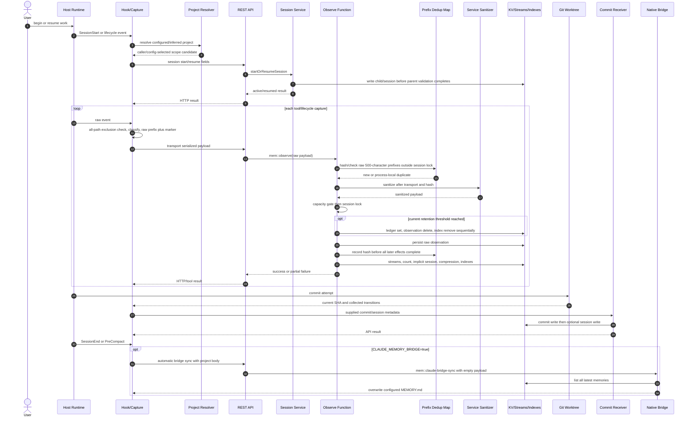
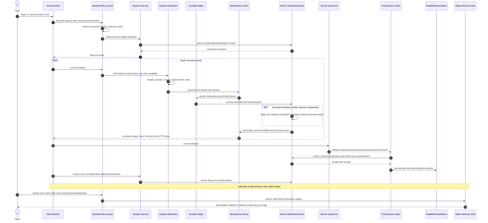
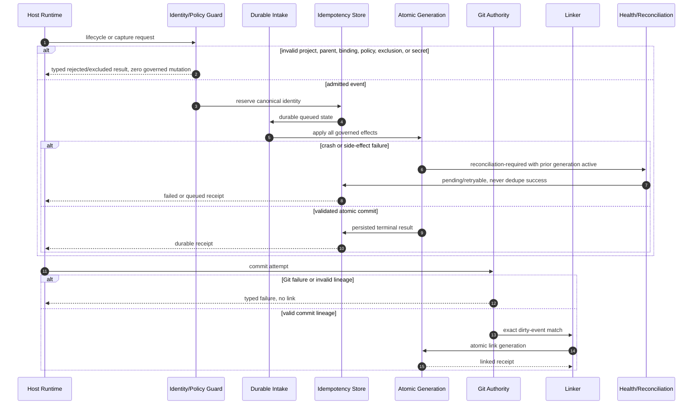

# DES-UCR-002: Capture, Session, and Commit Lifecycle

## Metadata

| Field | Value |
|---|---|
| ID | `DES-UCR-002` |
| Parent use case | `UC-002 — Capture, Session, and Commit Lifecycle` |
| Iteration | AIWG SDLC Elaboration Iteration 4 |
| Author role | Documentation Synthesizer (advisory) |
| Inputs | Architecture Designer draft; independent Domain, Security, and Test reviews; current Draft requirements, traceability, ICM, SAD, architecture-evolution, risk, PoC, MTP, deterministic-profile, and runtime-health inputs |
| Review dispositions | Domain: `BLOCKED`; Security: `BLOCKED`; Test: `COMPLETE — BLOCKING TESTABILITY GAPS` |
| Status | **REVIEW CANDIDATE - BLOCKED - HUMAN ACCEPTANCE REQUIRED** |
| Synthesized | 2026-07-26 |
| Candidate source subject | `/private/tmp/chronode-agentmemory-elab-iter2`, branch `codex/agentmemory-elab-iter2`, exact `HEAD` `0e9af82dcfdf07dd1f521c4621823f31a9b2eaba`, tree `8c479b95bb9753911df212089d7faf3d6f35a28d` |
| Installed runtime subject | In-place ChronodeAi fork-derived, upstream-labelled `@agentmemory/agentmemory@0.9.28`; all embedded repository sources, the installed viewer, and package manifest match `b17d5d2`, but exact build provenance and byte-for-byte reproducibility remain unverified |
| Canonical traceability authority | `.aiwg/requirements/traceability-matrix.md`; this realization does not edit it |
| Sole output | `.aiwg/requirements/realizations/DES-UCR-002.md` |
| Directly exposed route telemetry | Requested/configured model `gpt-5.6-sol`, reasoning effort `high`, route `subagent` / `thread_spawn`, thread `019f9f56-6650-71c0-a97c-d6e791cc6971`, parent/session `019f7211-bfe3-7c21-ad5e-906681b9e332`, sandbox `seatbelt`; provider-observed model/effort unavailable |

## Governance and Decision Boundary

This artifact is a blocked review candidate. It does not:

- record human approval or acceptance of this realization, any requirement,
  architecture choice, ADR, MTP, deterministic profile, risk treatment, or
  PoC;
- create an architecture baseline, change the current ABM FAIL / NO-GO, or
  claim ABM PASS;
- mitigate, accept, retire, or otherwise change any risk;
- admit or execute a PoC;
- authorize Construction, product-code or test changes, connector changes,
  native-memory synchronization, deployment, distribution, canary use, or
  rollout; or
- create or update any traceability index or matrix.

The generic `generate-realization` auto-approval and traceability-index
behaviors are overridden. Human acceptance, architecture acceptance, ABM
review, risk disposition, Construction authorization, release authorization,
and rollout authorization remain separate decisions.

## DEC-15 and DEC-16 Application

The
[Iteration 4 local macOS disposition](../../reports/iteration-4-local-macos-human-disposition-2026-07-28.md)
records **CRD-01 Option A selected** as DEC-15 and **CRD-02 Option A selected**
as DEC-16.

- DEC-15 permits the exact parent path
  [UC-002](../use-case-briefs/UC-002-capture-session-commit.md), this
  realization, and the canonical
  [Requirements Traceability Matrix](../traceability-matrix.md) to satisfy
  Elaboration bidirectionality when the documentary chain is independently
  graph-verified. Live source and test annotations remain Construction work.
  This propagation does not claim that verification or accept the links.
- DEC-16 fixes the complete significant-use-case denominator at
  `DES-UCR-001..003`, tailors MIC and PSC out, and requires this realization
  independently to satisfy at least 44 of the following 54 frozen binary
  behavioral units:

```text
UC2-LIF-01, UC2-LIF-02, UC2-LIF-03, UC2-LIF-04, UC2-LIF-05,
UC2-LIF-06, UC2-LIF-07, UC2-LIF-08, UC2-LIF-09, UC2-LIF-10,
UC2-CAP-01, UC2-CAP-02, UC2-CAP-03, UC2-CAP-04,
UC2-PRIV-01, UC2-PRIV-02, UC2-PRIV-03, UC2-PRIV-04, UC2-PRIV-05,
UC2-DED-01, UC2-DED-02, UC2-DED-03, UC2-DED-04, UC2-DED-05,
UC2-SEM-01,
UC2-CMP-01, UC2-CMP-02, UC2-CMP-03, UC2-CMP-04, UC2-CMP-05,
UC2-PROV-01, UC2-PROV-02, UC2-PROV-03,
UC2-COM-01, UC2-COM-02, UC2-COM-03, UC2-COM-04, UC2-COM-05,
UC2-COM-06,
UC2-PERF-01, UC2-PERF-02, UC2-PERF-03,
UC2-CONN-01, UC2-CONN-02, UC2-CONN-03,
UC2-NAT-01, UC2-NAT-02,
UC2-WRK-01, UC2-WRK-02, UC2-WRK-03,
UC2-REG-01, UC2-REG-02, UC2-REG-03, UC2-REG-04
```

The threshold is `ceil(0.80 * 54) = 44`. A unit scores `1` only when an
independent review confirms its explicit behavioral contract, requirement
link, expected result, forbidden result or side effect, and evidence target;
otherwise it scores `0`. Presence in this file is not a pass. No unit or this
realization is accepted by the selection or this propagation, and no Stage A,
ABM, or Construction status follows.

## Evidence Subjects, Authority, and Precedence

### Evidence labels

| Label | Meaning |
|---|---|
| **[I-CANDIDATE]** | Exact runtime-wired source in candidate `HEAD` `0e9af82dcfdf07dd1f521c4621823f31a9b2eaba`, confirmed through Codebase Memory discovery and exact source. It is not proof that this candidate produced installed-runtime observations. |
| **[X-RUNTIME]** | Point-in-time observation of the in-place fork-derived, upstream-labelled `0.9.28` runtime, CLI, viewer, process, or connector state. It is not official-upstream evidence, current-HEAD candidate evidence, or root-cause proof. |
| **[P]** | Proposed behavioral contract derived from Draft requirements, Draft architecture, Proposed ADRs, risk/test planning, or this realization. It is not established implementation. |
| **[G]** | Unresolved human policy, evidence, implementation, provenance, denominator, acceptance, or decision. |

No row may use `[X-RUNTIME]` to establish candidate behavior, and no
`[I-CANDIDATE]` mechanism is inferred to have caused an installed-runtime
observation without artifact provenance.

### Review interpretation precedence

1. `WORKSPACE.md` governance and the assignment's sole-write boundary.
2. UC-002 and the atomic children in the current Supplemental Specification.
3. The canonical Requirements Traceability Matrix and Draft ICM.
4. The Draft SAD and Iteration 4 architecture-evolution candidate.
5. ADR-001 through ADR-007 as Proposed constraints only.
6. The active risk register, assessment, PoC plan, and non-admitted case cards.
7. The Draft MTP and unaccepted deterministic-profile packet.
8. Candidate source and bounded test execution for current implementation
   facts.
9. The runtime-health refresh for installed-runtime regression seeds only.
10. UC-001 canonical realization for vocabulary consistency only.

All cited candidate source paths reported `no_recorded_issue` and
`metadata_match` in the best-effort Codebase Memory generation
`2026-07-26T02:31:05Z`. That signal is not completeness proof; exact source is
controlling for the implementation statements below.

## Traceability

### Atomic requirements and canonical controls

| UC-002 concern | Atomic requirements | Canonical trace / control | Risks |
|---|---|---|---|
| Canonical project, worktree, and scope | FR-01.a–e, FR-02.a–d, FR-03.a–d; NFR-01.a, NFR-04.a | TR-UCM-001 / ICM-01; TR-UCM-002 / ICM-02 | R-01 |
| Exact-event identity and semantic duplicates | FR-05.a–d; NFR-06.a | TR-UCM-003 / ICM-03; TR-UCM-017 / Proposed ICM-17 | R-05, R-21 |
| Session resume, immutable binding, stale CAS, child validity, crash truth | FR-06.a–g | TR-UCM-004 / ICM-04 | R-06, R-20 |
| Capture profile, exclusion, redaction, bounds, authoritative policy, and processing mode | FR-07.a–f; FR-15.a, FR-15.e, FR-15.g, FR-15.h; NFR-02.a | TR-UCM-003 / ICM-03; TR-UCM-009 / ICM-09; TR-UCM-010 / ICM-10; TR-UCM-014 / ICM-14 | R-02, R-07, R-15, R-21 |
| Rolling history and exact-facts generation | FR-08.a–c | TR-UCM-017 / Proposed ICM-17 | R-22 |
| Adjacent freshness and required-source truth | FR-09.a–g, FR-19.b–e; NFR-03.a | TR-UCM-005 / ICM-05 | R-03, R-17, R-18 |
| Dirty and committed provenance | FR-10.a–d, FR-12.a, FR-12.f; NFR-07.a, NFR-10.a–b | TR-UCM-007 / ICM-07 | R-06 |
| Anti-self-reinforcement and corroboration | FR-13.a–e | TR-UCM-008 / ICM-08 | R-03, R-05 |
| Explicit, scoped, atomic native synchronization | FR-14.a–e | TR-UCM-018 / Proposed ICM-18 | R-19; adjacent R-01, R-02 |
| Authentication and authority downgrade | FR-15.b–f, FR-16.a–b, FR-19.a–e | TR-UCM-009 / ICM-09 | R-02, R-14, R-18 |
| Connector custody and durable hook outcomes | FR-17.a–f, FR-18.a–h; NFR-09.a | TR-UCM-014 / ICM-14 | R-07, R-11, R-23 |
| Worker readiness, reconciliation, viewer scope, denominators, and orthogonal local/provider state | FR-12.b–f, FR-20.a–l; NFR-11.a–b | TR-UCM-011 / ICM-11; TR-UCM-012 / ICM-12 | R-07, R-08, R-09, R-23 |
| Local macOS package and lifecycle prerequisite | FR-21.a–g | TR-UCM-019 / Draft ICM-19 | R-02, R-07, R-09, R-11, R-13, R-14, R-16, R-23; local R-01/R-08 obligations retain the exact P2 trace edges |
| Deterministic evidence | NFR-12.a–b | TR-UCM-016 / ICM-16 | R-13 |

The Iteration 4 atomic additions used explicitly are `FR-05.c`, `FR-05.d`,
`FR-06.e`, `FR-06.f`, `FR-06.g`, `FR-07.e`, `FR-07.f`, `FR-08.c`,
`FR-09.e`, `FR-09.f`, `FR-09.g`, `FR-13.e`, `FR-14.c`, `FR-14.d`,
`FR-14.e`, `FR-15.f`, `FR-17.e`, `FR-17.f`, `FR-18.g`, `FR-18.h`,
`FR-15.g`, `FR-15.h`, `FR-19.e`, `FR-20.g`, `FR-20.h`, `FR-20.i`,
`FR-20.j`, `FR-20.k`, `FR-20.l`, and `FR-21.a`–`FR-21.g`.

`TR-UCM-017`–`TR-UCM-019` and `ICM-17`–`ICM-19` are current Draft
trace/control entries. Their presence corrects documentary gaps but does not
accept any control, ADR-006, requirement, local profile, or lifecycle journey.

### Proposed ADR relationships

| Proposed ADR | Candidate constraint used |
|---|---|
| ADR-001 | Canonical credential-free repository identity, stable worktree identity, immutable scope, and separately authorized global access |
| ADR-002 | Eligibility before relevance, immutable lineage, delivery-state separation, and no recalled-content self-verification |
| ADR-003 | Pre-boundary privacy, strict/local fail-closed behavior, bounded hook outcomes, connector custody, and truthful health |
| ADR-004 | Codebase Memory remains an external structural owner; Agentmemory has no authority to clean up its connector entries or indexes |
| ADR-005 | Strict core remains the sole authority; compatibility cannot silently downgrade, gain global authority, or become gate-critical |
| ADR-006 | Immutable generation activation and transactional outbox semantics for evidence, compaction, linkage, restart, and rollback |
| ADR-007 | Local macOS immutable package, owned LaunchAgent, loopback/authentication boundary, processing-mode separation, coordinated runtime/data activation, and isolated normal/canary/rollback instances |

Every ADR remains `Proposed`.

## Use-Case Summary

- **Primary actor:** coding client/user operating through a host agent runtime.
- **Scope:** Agentmemory candidate capture, session, compaction, provenance,
  linkage, closure, and explicitly requested provider-native synchronization.
- **Trigger:** a supported project-bound lifecycle event or a direct explicit
  user synchronization action.
- **Level:** user goal.

### Preconditions

1. **[P]** Canonical project and stable worktree identity resolve under an
   accepted registry and collision policy.
2. **[P]** Session, parent, invocation, actor, cwd, privacy, capture profile,
   and external-processing policy are authoritatively bound before admission.
3. **[P]** The accepted capture and retention profiles name every event class,
   exclusion rule, final-field bound, retention limit, and exact-fact class.
   Missing policy or limits deny admission.
4. **[P]** Every governed sink and side effect is enumerated.
5. **[P]** Commit linking uses a real server-validated repository/worktree and
   a predeclared eligible dirty-event denominator.
6. **[P]** Provider-native synchronization has a direct, attributable,
   single-use user authority bound to exact project, source IDs, destination,
   and policy.

### Success postconditions

1. **[P]** Each lifecycle request has one attributable, replay-idempotent
   transition result; project/worktree/cwd/policy bindings cannot be changed
   by an unauthorized resume or implicit observation.
2. **[P]** Each received event has one durable terminal disposition under the
   accepted profile and reason taxonomy.
3. **[P]** Raw excluded or sensitive bytes occur zero times across the complete
   governed-sink denominator.
4. **[P]** Retained fields satisfy human-accepted final serialized bounds;
   no suffix or marker exceeds those bounds.
5. **[P]** Exact retries converge to one complete terminal outcome, while
   same-prefix/different-suffix and independently sourced events remain
   distinct.
6. **[P]** Compaction activates one immutable, tamper-evident generation and
   preserves the accepted exact-fact denominator without semantic mutation or
   false independence.
7. **[P]** Every valid link names exact dirty-event IDs and server-validated
   project/worktree/ancestry/path/blob lineage. At least 95% of the frozen
   eligible denominator links validly; false-link tolerance is zero.
8. **[P]** Explicit close and stale/crash abandonment remain distinct.
9. **[P]** Automatic paths produce zero provider-native writes; an explicit
   sync preserves exact project/source selection and destination atomicity.

### Failure postconditions

1. **[P]** A project collision, invalid parent, policy absence, exclusion,
   secret, capacity event, service failure, crash, compaction failure, Git
   failure, fake link, connector failure, worker failure, or native-sink
   failure creates no fabricated persistence, delivery, dedupe, compaction,
   linkage, closure, or synchronization result.
2. **[P]** Failure leaves either the complete prior generation or the complete
   validated target generation, plus append-only failure truth.
3. **[P]** Host/tool/HTTP success is not durable terminal-state evidence.

## Local macOS Applicability and Behavior

`CR-AM-LOCAL-001` selects the local macOS deployment target and
`IA-AM-LOCAL-001` remains advisory; neither changes this realization's blocked
status. Capture and lifecycle admission apply `FR-15.a/g/h`: local deployment
does not imply zero egress, missing or ambiguous processing mode denies before
content or provider effects, explicit `zero-egress` records zero external
attempts, and explicit `provider-enabled` permits only a fully attributed,
minimized, redacted, manifest-listed attempt.

`FR-20.l` keeps local-core, provider-feature, configured-mode, and observed
external-processing states independent. `FR-21.a-g` and
`TR-UCM-019` / Draft `ICM-19` are local release prerequisites. Planned
`T-LOCAL-DEPLOY` coverage is `LQ-001..004` for package/setup/LaunchAgent,
`LQ-005..007` for bind/auth/identity, `LQ-008..010` for owned integrations and
isolation, `LQ-011/012` for both processing policies, and `LQ-013/014` for
backup through exact restore, upgrade, rollback subject, switch denial,
uninstall, support, and health. No journey or 42-execution cohort has been
admitted or run.

The operator-supplied live Agentmemory diagnostics in the canonical RTM are
`[X-RUNTIME]` regression seeds only. Top-level health/Doctor and project-health
success coexist with project slot list/get HTTP 500 and a warning that 2 of 2
latest durable memories lack project scope. This is a truthful-degradation and
diagnostic-denominator gap, not capture/lifecycle qualification; no session
content is quoted and no heal or migration was authorized or run.

## Evidence-Subject Inventory

| Subject | Direct fact | Permitted interpretation |
|---|---|---|
| Candidate source | **[I-CANDIDATE]** Exact `HEAD` is `0e9af82…`; no `src/` or `test/` change is present in this synthesis worktree. | Current source wiring only. |
| Installed runtime provenance | **[X-RUNTIME]** Executable is a global fork-derived package labelled `0.9.28`; its bytes differ from official npm and its embedded sources, viewer, and package manifest match `b17d5d2`. | It is source-consistent with `b17d5d2`, but exact build provenance and reproducibility are unverified; it is not official upstream or equivalent to current candidate HEAD. |
| Candidate tests | **[I-CANDIDATE]** Two independently selected focused test sets passed within their bounded scopes. | Narrow implementation evidence, not qualification or acceptance. |
| Installed runtime health | **[X-RUNTIME]** Point-in-time CLI/service/viewer observations are recorded in the runtime-health refresh. | Regression seeds only; no candidate causation or sustained-health conclusion. |
| Proposed contracts | **[P]** Draft requirements, Draft ICM/SAD, architecture evolution, Proposed ADRs, risks, and test plans. | Review requirements and evidence obligations only. |

## Current Candidate Ordering and Vulnerabilities

### Actual current order

The current candidate order is materially different from the target order:

1. **[I-CANDIDATE]** Hook capture discovers selected path fields, drops only
   when the discovered set is non-empty and every path is excluded, classifies
   the capture profile, and serializes/truncates raw input/output.
2. **[I-CANDIDATE]** The hook transports that payload to the service.
3. **[I-CANDIDATE]** `mem::observe` computes and checks a process-local
   fingerprint over raw, unsanitized 500-character input/output prefixes.
   This happens before capacity admission and outside the per-session lock.
4. **[I-CANDIDATE]** Service sanitization then transforms the payload.
5. **[I-CANDIDATE]** Capacity admission and the session lock follow.
6. **[I-CANDIDATE]** Compaction, when triggered, writes each ledger row,
   deletes each observation, and removes each in-memory index entry
   sequentially.
7. **[I-CANDIDATE]** The raw observation is persisted. The dedupe map is then
   recorded before stream, session-count, compression, vector/index, and final
   stream effects complete.
8. **[I-CANDIDATE]** If no session exists, observation persistence can precede
   later implicit session creation; absent project/cwd leaves an orphan
   observation namespace. Caller-supplied policy fields can create or weaken
   the implicit session policy, and undefined policy can permit later external
   processing.
9. **[I-CANDIDATE]** Post-commit collection gathers some Git facts, but the
   receiver trusts supplied commit identity, discards key worktree/base/
   transition evidence, and writes commit/session state separately.
10. **[I-CANDIDATE]** Session-end and pre-compact can automatically invoke the
    native bridge when configured; the API discards request project and the
    bridge selects all latest memories.

### Actual candidate sequence



This diagram is descriptive evidence for the candidate source, not a target
contract and not an explanation of installed-runtime behavior.

### Balanced-capture characterization

| Candidate predicate | Current selected fields | Current size behavior | Exclusion behavior | Redaction point | Proposed policy treatment |
|---|---|---|---|---|---|
| `minimal` and not failure/high-value regex | No capture | N/A | All-discovered-path exclusion runs first | No service request if dropped | **[P]** Accepted profile must classify every host/tool event and record a durable terminal disposition without raw leakage. |
| `balanced`, not high-value, tool name matches `read/view/open/search/grep/glob/find/list/status/inspect/query` token regex | Selected input keys (`file_path`, `path`, `file`, `pattern`, `query`, `cmd`, `command`, `workdir`, `cwd`) plus output length and SHA-256 | Selected input fields use a 500-character prefix plus marker when truncated; output digest is computed from raw serialized output | Only a non-empty all-excluded discovered-path set drops; mixed sets proceed | Service-side, after transport and dedupe hash | **[G]** Human owner must decide whether sensitive/excluded-content digests are permitted metadata. |
| Failure or tool name matches `edit/write/create/patch/apply/test/spec/migrat/commit/task/decision/deploy/build` | Payload-bearing raw input/output; successful mutation regex may add current post-state provenance | 8,000-character prefix plus `\n[...truncated]`; final field exceeds 8,000 | Mixed allowed/excluded sets proceed; failed mutations omit equivalent provenance | Service-side, after transport and dedupe hash | **[P]** Final field, including marker, must fit the accepted bound after pre-sink redaction. |
| Other balanced events, all `full` profile events, and unknown tool names | Payload-bearing raw input/output; unknown defaults to payload-bearing capture | 1,000-character prefix plus marker, or 8,000 for high/failure; final field exceeds prefix limit | Pathless sensitive content is not excluded by the path predicate | Service-side, after transport and dedupe hash | **[P]** Unknown/unclassified classes fail closed or follow an explicitly accepted class; “payload-bearing” never means unbounded. |

The `1,000`, `8,000`, and current compaction threshold are
**[I-CANDIDATE]** characterization values and diagnostic fixture seeds only.
They are not proposed acceptance values. The target uses a versioned,
human-accepted profile; absent values deny admission.

### Source-confirmed vulnerability register

| Risk | Candidate-source vulnerability | Consequence boundary |
|---|---|---|
| R-19 | **[I-CANDIDATE]** Automatic session-end/pre-compact paths can invoke a bridge that ignores request project, selects all latest memories, and writes one configured native file. | Cross-project/global/unscoped export and provider-native contamination without direct user action. |
| R-20 | **[I-CANDIDATE]** Caller/config identity can replace effective project; existing session cwd, parent, privacy, capture, and external-processing fields are mutable; stale close is unlocked; the child is persisted before parent validation; attribution is partial. | Lifecycle takeover, stale-resume overwrite, orphan/misleading parent state, policy/worktree corruption. |
| R-21 | **[I-CANDIDATE]** Dedupe uses process-local five-minute state and 500-character prefixes; check is outside the session lock; concurrent duplicates can pass; record occurs before all effects complete; retry can receive fabricated dedupe success for partial state. | Distinct evidence loss, duplicate side effects, restart replay, false terminal success. |
| R-22 | **[I-CANDIDATE]** Ledger write, source delete, index removal, count/summary/new-admission effects are non-atomic; ledger has no generation/integrity chain. | Mixed readers, orphan indexes, duplicate/lost facts, undetected tampering. |
| R-23 | **[I-CANDIDATE]** Worker is terminal/process associated in source startup mechanics, with PID handling but no source-wired durable intake replay, automatic supervision, singleton fencing, or startup reconciliation. | Accepted-event loss/duplication and premature healthy state after failure. |
| R-02 / R-15 | **[I-CANDIDATE]** Raw payload crosses hook transport and enters dedupe material before service redaction; mixed/pathless content can bypass exclusion; implicit session and missing policy can admit later external processing. | Secret/sensitive disclosure and undeclared egress. |
| R-05 | **[I-CANDIDATE]** Similar memory supersession can hide prior corroborating source lineage; lesson similarity/direct strengthening can increase confidence without independent typed evidence. | Corroboration loss and recalled/cyclic self-reinforcement. |
| R-06 | **[I-CANDIDATE]** Dirty capture lacks immutable dirty IDs and pre/post pairs; receiver trusts supplied SHA, discards collected transition evidence, and writes commit/session separately. | Forgeable, non-atomic dirty-to-commit attribution. |
| R-07 / R-17 | **[I-CANDIDATE]** Hook delivery has bounded attempts but no durable queue; failures can be written to stderr while host exit remains successful. | Dropped evidence and fabricated host success. |
| R-11 | **[I-CANDIDATE]** Connector ownership uses command/path resemblance, full JSON reserialization, and backups without a complete owner/mode/no-follow/custody contract. | Unowned hook removal or normalization and sensitive backup disclosure. |
| R-14 / R-18 | **[I-CANDIDATE]** Project token integrity does not establish entitlement or operation least privilege; broad protected MCP proxy errors can fall back to local authority/storage. Direct UC-002 REST hooks do not traverse that MCP fallback. | Capability abuse and downgrade interaction without falsely attributing the shim to direct REST delivery. |

### Exact candidate-source anchors

| Concern | Exact source paths checked |
|---|---|
| Identity and lifecycle | `src/project-config.ts`, `src/functions/session-lifecycle.ts`, `src/triggers/api.ts`, `src/state/schema.ts` |
| Hook capture, privacy, delivery, and dedupe ordering | `src/hooks/_capture.ts`, `src/hooks/_observe-delivery.ts`, `src/functions/dedup.ts`, `src/functions/privacy.ts`, `src/functions/observe.ts` |
| Compaction and count projections | `src/functions/observe.ts`, `src/functions/summarize.ts`, `src/types.ts`, `src/state/schema.ts`, `src/cli.ts` |
| Semantic corroboration and strengthening | `src/functions/remember.ts`, `src/functions/lessons.ts` |
| Dirty and commit provenance | `src/hooks/post-commit.ts`, `src/triggers/api.ts`, `src/functions/coding-memory.ts`, `src/types.ts` |
| Native bridge | `src/hooks/session-end.ts`, `src/hooks/pre-compact.ts`, `src/triggers/api.ts`, `src/functions/claude-bridge.ts`, `src/config.ts` |
| Connector custody | `src/cli/connect/codex-hooks.ts`, `src/cli/connect/codex.ts`, `src/cli/connect/util.ts` |
| Capability and MCP downgrade | `src/auth.ts`, `src/hooks/_auth.ts`, `src/mcp/rest-proxy.ts`, `src/mcp/standalone.ts` |
| Worker lifecycle and recovery gap | `src/cli.ts`, `src/index.ts`, `src/hooks/_observe-delivery.ts` |

## Proposed Target Ordering

1. **[P]** Resolve canonical project/worktree identity and authoritative policy
   before reading or serializing governed content.
2. **[P]** Validate lifecycle authority and immutable bindings before any
   child/session/observation write.
3. **[P]** Apply capture classification, structural exclusion, final-field
   bounds, and redaction before every governed sink.
4. **[P]** Derive a complete canonical event identity from the permitted
   representation and reserve it durably under one atomic transaction.
5. **[P]** Queue or process the admitted event under attributable attempt
   state; restart replays only durable queued events.
6. **[P]** Atomically commit observation, session/count, stream, search/vector,
   audit/outbox, idempotency result, and any compaction generation.
7. **[P]** Derive dirty receipts from server-owned Git/worktree facts.
8. **[P]** Validate the resulting commit server-side and atomically supersede
   exact eligible dirty-event IDs.
9. **[P]** Close explicitly or mark abandoned through a durable lifecycle
   transition.
10. **[P]** Perform provider-native synchronization only through a separate
    explicit user action bound to exact source IDs and an atomic destination.



## Participating Components

| Component | Current candidate responsibility | Proposed obligation |
|---|---|---|
| Host runtime | Emits lifecycle and tool payloads. | Bind immutable event, attempt, actor, session, invocation, and host receipt IDs. |
| Project resolver | Infers/configures project and worktree context. | Resolve through an owner-proven registry; configuration precedence is not entitlement. |
| Scope/auth/policy guard | Checks selected request claims and service auth. | Enforce exact project/worktree/operation/subject/policy authority before content handling. |
| Connector/hooks | Classify selected events, truncate payloads, and deliver requests. | Pre-sink exclusion/redaction, durable intake, recursion-safe telemetry, exact owned-region custody. |
| Session service | Starts/resumes sessions and updates parents; stale scans abandon rows. | Immutable bindings, typed invalid-parent zero-write, CAS stale handling, durable transitions. |
| Capture admission | Validates minimum payload, capacity, and selected session match. | Versioned profile/policy decision before any sink; no implicit policy/session authority. |
| Privacy boundary | Sanitizes service payload. | Apply before serialization, transport, fingerprinting, logs, queues, provider/native calls, and all sinks. |
| Idempotency service | Process-local prefix map. | Complete canonical identity, atomic reservation/result, restart/concurrency reconciliation. |
| Observation transaction | Writes observation then sequential derived effects. | One atomic state/outbox result for all required effects. |
| Compactor/fact ledger | Sequential ledger/write/delete/index handling. | Immutable tamper-evident generation, exact-fact manifest, atomic activation, rollback. |
| Memory/lesson semantics | Similarity supersession and strengthening. | Preserve corroboration and prohibit recalled/cyclic/derived independence inflation. |
| Git provenance collector | Collects current worktree/base/path/blob and commit transitions. | Immutable dirty IDs, pre/post pairs, failed-operation and shell/script reconciliation. |
| Commit receiver/linker | Accepts supplied metadata and separately updates state. | Server-owned Git validation and atomic exact-dirty supersession. |
| Health/viewer | Reports process/service/counters and renders runtime data. | Separate liveness, readiness, compatibility, reconciliation, scope, snapshot, and denominator. |
| Native bridge | Config-triggered all-latest write to one file. | Explicit user-only, exact project/source selection, destination ownership, atomic rollback/readback. |
| Codebase Memory owner | Owns external structural connector/index state. | Remains outside Agentmemory mutation authority; unowned bytes are preserved. |

## Main Success Scenario

| UC step | Proposed realization | Current candidate boundary |
|---:|---|---|
| 1. Start/resume and child links are project-bound and idempotent | **[P]** Validate canonical project/worktree/actor/operation before one atomic lifecycle transition. Active replay is no-op; completed/abandoned resume is explicit; valid child and reciprocal parent edge commit together. | **[I-CANDIDATE]** Same-session project mismatch denies, but cwd/policy/parent can change; stale marker survives resume; child can persist before parent validation; stale close lacks lock/CAS. |
| 2. Balanced capture records bounded high-value lifecycle events | **[P]** An accepted profile classifies every event into payload-bearing, metadata-only, excluded, rejected, or dropped with a policy version and terminal receipt. | **[I-CANDIDATE]** Regex categories and prefixes exist; unknown defaults to payload-bearing; final marker exceeds prefix limit; no complete profile receipt. |
| 3. Exclusions and redaction precede persistence | **[P]** Structural exclusion, minimization, final bounds, and redaction precede every governed sink. | **[I-CANDIDATE]** Mixed/pathless content can proceed; transport and raw prefix hashing precede service sanitization. |
| 4. Exact and semantic dedupe suppress true duplicates | **[P]** Complete canonical event identity plus durable atomic reservation handles replay; semantic clustering preserves independent lineage and uses a frozen human-labelled corpus. | **[I-CANDIDATE]** Prefix/process-local exact dedupe races and can fabricate retry success; capture has no observation semantic-dedupe stage; separate memory/lesson paths can lose corroboration or self-reinforce. |
| 5. Rolling compaction preserves exact facts | **[P]** The accepted retention profile stages one immutable generation; exact-fact count/digest/order/lineage equivalence and integrity root validate before activation. | **[I-CANDIDATE]** Current threshold and one-fifth batch are implementation values; sequential writes/deletes/index removal provide no generation or tamper proof. |
| 6. Work records dirty or committed provenance | **[P]** Every eligible mutation, including failed/partial and shell/script changes, has immutable dirty identity and complete worktree/base/path/rename/pre/post/time/session/invocation lineage. | **[I-CANDIDATE]** Selected successful mutation tools capture post-state facts only; no dirty ID/pre-post pair; receiver discards transition fields. |
| 7. Eligible records link and session terminates truthfully | **[P]** Server validates real Git lineage, atomically links exact eligible dirty IDs, reports the frozen denominator, and records explicit close or abandoned state. | **[I-CANDIDATE]** Supplied SHA/basic session link is forgeable and non-atomic; host/HTTP success is not durable linkage; closure/recovery receipts are incomplete. |

## Lifecycle Transition Contract

| Request | Required prior state | Proposed result | Denominator outcome | Current gap |
|---|---|---|---|---|
| `start(new)` | No session; valid project/worktree authority | One `active` session and transition receipt | one received, one admitted, one persisted transition | Caller/config identity and policy authority unresolved. |
| `start(active replay)` | Same immutable bindings | No state mutation; replay receipt | one received, one deduped transition request | Current active replay can mutate cwd/policy/parent/title. |
| `resume(completed\|abandoned)` | Same real host session and immutable bindings | Explicit reactivation; terminal timestamps reconciled under accepted schema | one received, one persisted transition | Current resume clears `endedAt` but preserves `staleClosedAt`. |
| `child(valid)` | Active same-project parent plus invocation identity | Child and reciprocal edge commit atomically once | one received, one persisted edge outcome | Child currently writes before parent validation and lacks invocation receipt. |
| `child(invalid)` | Missing, self, stale, or wrong-project parent | Typed zero-mutation denial | one received, one rejected | Current child can retain misleading `parentSessionId`. |
| `close(explicit)` | Active authorized session | `closed` with clean terminal receipt | one received, one closed | Hook/API success does not prove durable terminal state. |
| `stale-close(active)` | Expired version under lock/CAS | `abandoned`; cannot overwrite newer resume | one received, one abandoned or superseded attempt | Current list-then-set is unlocked. |
| `crash/restart` | Any in-flight transition | Reconcile to complete prior or next state; never infer clean close | one received attempt plus one terminal recovery result | No durable transition journal/startup reconciliation. |

Lifecycle denominators count transition requests and their terminal outcomes,
not only final session rows.

## Alternate and Exception Flows

### Lifecycle and scope

| ID | UC step | Flow and required result |
|---|---:|---|
| `UC2-LIF-01` | 1 | Fresh valid start creates one active project/worktree/session projection and one transition receipt. |
| `UC2-LIF-02` | 1 | Sequential/concurrent active replay changes zero immutable bindings and returns one replay outcome per attempt. |
| `UC2-LIF-03` | 1, 7 | Resume after stale abandonment reconciles terminal fields and attaches new events to the same session; the installed-runtime stale task is a regression seed, not proof of cause. |
| `UC2-LIF-04` | 7 | Explicit close and stale abandonment remain distinct and replay-idempotent. |
| `UC2-LIF-05` | 1, 7 | Crash at each session/parent/close/receipt boundary exposes only complete prior or next lifecycle state. |
| `UC2-LIF-06` | 1 | Valid parent/child replay under concurrency and restart leaves one reciprocal attributed edge. |
| `UC2-LIF-07` | 1 | Missing, self, stale, or wrong-project parent yields typed rejection and zero child/parent/cross-project mutation. |
| `UC2-LIF-08` | 1, 7 | Two stale workers racing a resume use CAS/lock; stale attempt is denied/superseded and cannot overwrite active state. |
| `UC2-LIF-09` | 1–7 | Caller attempts to change project/worktree/cwd/privacy/capture/external-processing binding; request denies with byte-identical state. |
| `UC2-LIF-10` | 2–3 | Missing authoritative session/project/policy on observation denies before observation, queue, index, session, or provider side effects; no orphan observation. |

### Capture, privacy, dedupe, and semantic integrity

| ID | UC step | Flow and required result |
|---|---:|---|
| `UC2-CAP-01` | 2 | Accepted profile maps every host/tool class to one declared payload-bearing, metadata-only, excluded, rejected, or dropped outcome. |
| `UC2-CAP-02` | 2 | Current `1,000` prefix-plus-marker behavior is characterized; future final-field bounds come only from the accepted profile. |
| `UC2-CAP-03` | 2 | Current `8,000` high/failure prefix-plus-marker behavior is characterized; failed mutations remain provenance-visible. |
| `UC2-CAP-04` | 2 | ASCII, combining, newline, and astral Unicode fixtures follow one accepted byte/character model. |
| `UC2-PRIV-01` | 3 | Unique synthetic secrets in every field/path/error/image/metadata position produce zero raw occurrence in every sink. |
| `UC2-PRIV-02` | 3 | Strict/local plus lower-precedence permissive config produces zero external attempt across provider/fallback/native/mesh paths. |
| `UC2-PRIV-03` | 3 | Missing, stale, malformed, timed-out, or unavailable policy denies before content serialization and side effects. |
| `UC2-PRIV-04` | 3 | Mixed excluded/allowed paths, nested paths, pathless content, and failure payloads are structurally removed or deny the whole event; no raw remnants survive. |
| `UC2-PRIV-05` | 3 | Faults after transport preparation, logging, queueing, persistence, indexing, backup, and rollback still yield zero raw occurrence. |
| `UC2-DED-01` | 4 | Exact repeat within/beyond current TTL and after restart resolves to one durable event identity and terminal result. |
| `UC2-DED-02` | 4 | Same 500-character prefix with different suffix yields two distinct admitted identities and zero false dedupe. |
| `UC2-DED-03` | 4 | Barrier-released concurrent identical arrivals create one complete governed outcome; all attempts reconcile. |
| `UC2-DED-04` | 4 | Crash after reservation or any side effect returns pending/retryable until complete or rolled back; no fabricated dedupe success. |
| `UC2-DED-05` | 4 | Human-labelled semantic corpus measures duplicate observations below 2% without collapsing independently sourced corroboration. |
| `UC2-SEM-01` | 4–5 | Recall, summary, compaction, paraphrase, copy, or cyclic lesson content creates no new independent evidence and cannot increase confidence, promotion eligibility, or source count. |

### Compaction, provenance, linkage, and closure

| ID | UC step | Flow and required result |
|---|---:|---|
| `UC2-CMP-01` | 5 | Accepted retention boundary triggers one staged generation; current `499→500` behavior remains a diagnostic fixture only. |
| `UC2-CMP-02` | 5 | Clean verifier reconstructs the accepted exact-fact classes with identical canonical counts, digests, order, project/session/worktree/source lineage, and policy/schema versions. |
| `UC2-CMP-03` | 5 | Death before/after summary, ledger, delete, index, count, new observation, receipt, and pointer stages exposes only complete prior or target generation. |
| `UC2-CMP-04` | 5 | Ledger mutation, insertion, deletion, reorder, source substitution, or replay is detected before recall/export/promotion use. |
| `UC2-CMP-05` | 5 | Concurrent readers pin one generation and never see mixed narrative/ledger/index/count state. |
| `UC2-PROV-01` | 6 | Write/edit/patch/rename/delete/untracked/shell/script mutation produces immutable dirty-event lineage with pre/post facts. |
| `UC2-PROV-02` | 6 | Failed/partial mutation distinguishes attempted from observed filesystem change and never fabricates clean success. |
| `UC2-PROV-03` | 6 | Reconciliation replay across restart is idempotent and preserves unmatched dirty/uncertain work. |
| `UC2-COM-01` | 7 | Git failure with no resulting commit produces zero commit/link/session-SHA success state. |
| `UC2-COM-02` | 7 | Malformed, nonexistent, historical, cross-repository, or wrong-worktree SHA denies with zero partial link. |
| `UC2-COM-03` | 7 | Wrong ancestry, path/rename/copy/delete chain, pre-image, or post-commit blob leaves event dirty/uncertain. |
| `UC2-COM-04` | 7 | Exact server-validated lineage atomically supersedes only named matching dirty-event IDs and is replay-idempotent. |
| `UC2-COM-05` | 7 | Crash before/after commit, dirty supersession, session, index, metric, audit, and outbox writes leaves one complete link or complete prior state. |
| `UC2-COM-06` | 7 | Numerator is valid exact lineage over a frozen dirty-event denominator; at least 95% coverage does not permit any false link. |

### Hook delivery, connector, native synchronization, worker, and health

| ID | UC step | Flow and required result |
|---|---:|---|
| `UC2-PERF-01` | 2–7 | Human-accepted load profile measures end-to-end p95 below 2 seconds and all MTP resource/leakage thresholds. |
| `UC2-PERF-02` | 2–7 | Event/attempt ledger records queued/retried transitions and exactly one delivered/rejected/dropped/failed terminal result; no telemetry recursion. |
| `UC2-PERF-03` | 2–7 | Worker death replays only durable queued events with exact event/project/session/policy/payload binding. |
| `UC2-CONN-01` | 1–7 | Disposable homes recognize direct-binary and accepted `npx` declarations without touching the real home. |
| `UC2-CONN-02` | 1–7 | Dry-run/apply/reapply changes only proven Agentmemory-owned bytes, is zero-diff on reapply, and preserves all four observed unowned Codebase Memory reminders byte-for-byte. |
| `UC2-CONN-03` | 1–7 | Invalid JSON, mixed-owner entry, symlink/hardlink, owner/mode, concurrent rewrite, backup secret, and interruption cases fail closed or restore exact pre-image. |
| `UC2-NAT-01` | 7 | Every automatic hook/capture/compaction/recall/restart/repair path produces zero native-memory attempt/write without direct user authority. |
| `UC2-NAT-02` | 7 | Explicit user action names immutable source IDs from one exact project and atomically updates one owned destination; faults preserve byte-identical pre-image. |
| `UC2-WRK-01` | 1–7 | Forced worker death restarts under singleton fencing, rebinds exact build/state, and keeps readiness unavailable/recovering until reconciliation. |
| `UC2-WRK-02` | 1–7 | Shell exit, logout, host restart, stale/reused PID, and dual-start cases follow accepted supervision without duplicate worker authority. |
| `UC2-WRK-03` | 1–7 | Pending/partial/completed-not-acknowledged events reconcile exactly once; poison events quarantine without cascading false success. |
| `UC2-REG-01` | 1–7 | Isolated stale-current-task reproduction yields an active/resumed projection and one terminal outcome per marker or a typed non-healthy discontinuity. |
| `UC2-REG-02` | 5, 7 | Top-level, summary, active-history, lifetime-admission, compacted-fact, viewer, and CLI counts expose scope, denominator, snapshot/time, and reconciliation status. |
| `UC2-REG-03` | 1–7 | Project viewer renders zero global/other-project durable memory; explicit global view is separately authorized and labelled. |
| `UC2-REG-04` | 2–5 | Frozen exact-query benchmark labels freshness/eligibility; the installed-runtime `0/5` sample is only a regression seed. |

### Proposed failure and recovery sequence



## State Meanings and Denominators

| State | Exact meaning | Denominator / terminal role | Must not imply |
|---|---|---|---|
| `received` | An Agentmemory-owned ingress observed an event envelope and assigned immutable event and attempt identities. | Capture denominator entry; non-terminal. | admission, policy success, delivery, or persistence |
| `admitted` | Authoritative identity, policy, profile, exclusion, bounds, and dependency gates allowed processing. | One admission decision per event; non-terminal. | queue durability or persistence |
| `redacted` | Named sensitive/excluded ranges were removed or replaced under a policy before every downstream sink. | Orthogonal transformation flag, not a terminal outcome. | zero-leak proof without complete sink scan |
| `dropped` | Policy/pressure intentionally ended processing without persistence under a durable reason code. | Terminal event outcome. | silent loss, rejection, failure, or in-flight retry |
| `reserved` | A durable idempotency record claims the canonical event identity with pending/owner/generation state. | Non-terminal; one reservation identity may serve multiple attempts. | complete persistence or dedupe success |
| `persisted` | The active durable generation contains every required observation/session/count/stream/index/audit/outbox effect and terminal receipt. | Terminal event outcome. | raw KV sub-write, HTTP 2xx, tool/stdout success, or queue acceptance |
| `deduped` | A complete prior terminal event identity validly represents this exact replay; no new governed event effects occur. | Terminal event outcome for the replayed event; attempt records still reconcile. | prefix equality, semantic similarity, pending partial state, or collision |
| `compacted` | The accepted exact-fact denominator is count/digest/order/lineage equivalent in a tamper-evident active generation before source narrative becomes unavailable. | Terminal compaction-generation outcome. | summary existence or sequential delete completion |
| `linked` | Server-validated commit lineage atomically supersedes exact named eligible dirty-event IDs. | Terminal link outcome over the frozen eligible denominator. | SHA string presence, hook success, or session `commitShas` membership |
| `delivered` | The named receiver durably accepted the permitted envelope under an attributable delivery contract and terminal receipt. | Terminal delivery outcome in FR-18.g; separate from capture persistence unless one atomic receipt explicitly covers both. | HTTP/socket/stdout acceptance, provider acknowledgement, consumption, or persistence |
| `queued` | A durable replayable intake record exists with event/attempt/project/session/policy/payload digest and capacity ownership. | Non-terminal transition; must later reconcile to one terminal outcome. | delivered or persisted |
| `rejected` | Admission denied before governed event processing under a typed reason. | Terminal event outcome; no governed content side effect. | intentional post-admission drop or processing failure |
| `failed` | Attempted processing could not reach its declared terminal result; the durable result names retryability/reconciliation. | Terminal only when policy declares no further automatic retry; otherwise attempt outcome. | persisted, delivered, linked, closed, or dropped |
| `closed` | An explicit clean session terminal transition committed with one durable receipt. | Terminal lifecycle outcome. | timeout, stale scan, crash, hook return, or attempted end |
| `abandoned` | Stale/crash policy ended active attribution without claiming clean completion. | Terminal lifecycle outcome until an explicit resume transition. | deletion, clean closure, or irreversible non-resumability |

For capture, each unique admitted/received event must end in exactly one
accepted terminal class. The current proposed taxonomy uses `rejected`,
`dropped`, `deduped`, `failed`, or `persisted`; `redacted` is orthogonal,
`queued` and `reserved` are transitions, and `retried` is an attempt attribute.
If human owners choose an `excluded` terminal class, it must remain disjoint
and have a frozen reason taxonomy.

### Canonical denominator set

1. **Capture:** every event received by an Agentmemory-owned ingress.
2. **Attempt:** every delivery/processing attempt, including retries and
   recovery.
3. **Lifecycle:** every start/replay/resume/child/close/stale/crash request.
4. **Zero leak:** every unique synthetic sentinel crossed with every sink,
   success/failure/retry/crash/backup/rollback path; raw numerator is zero.
5. **Compaction:** every accepted exact fact selected under one immutable
   source manifest.
6. **Linkage:** eligible dirty-event IDs frozen with reason-coded exclusions
   before results; numerator is valid exact lineage.
7. **Pressure:** every attempt under one accepted host/concurrency/load/profile
   window with latency and disjoint transition/terminal counts.
8. **Connector:** every owned/unowned byte range and semantic entry across
   pre-image, dry-run, apply, reapply, failure, and rollback.
9. **Native sync:** every explicit action, source ID, project, destination
   image, attempt, automatic negative path, audit/outbox effect, and rollback.
10. **Count reconciliation:** active persisted observations, lifetime admitted
    observations, compacted facts, summary-snapshot observations, project CLI,
    global viewer, and any other projection, each with scope/snapshot/time.

## Governed Sinks and Side Effects

A governed side effect is any state mutation or externally observable emission
attributable to UC-002. Read-only Git inspection is not itself a mutation, but
captured/emitted Git content is governed.

| Sink class | Complete candidate denominator |
|---|---|
| Intake/transport | Hook stdin/stdout/stderr, serialization buffers, REST/MCP/socket requests and responses, retries, queues/spools, delivery diagnostics |
| Primary state | Sessions, parent/child edges, observations, summaries, fact ledger, memories/lessons touched by semantic handling, dirty events, commits/links, native-sync action state |
| Derived state | Search/BM25/vector/graph indexes, image refs/files, streams, caches, counters, health windows, metrics, viewer/API snapshots |
| Evidence/control | Idempotency reservations/results, generations/pointers, journals, tombstones, audits, outbox, transition/link/rollback receipts, dead-letter/quarantine state |
| Host/config | Codex/Claude TOML/JSON, temporary files, backups, atomic-write files, ownership/mode metadata, connector diagnostics |
| External processing/storage | Provider/embedding/vision/mesh attempts, provider-native memory, exports, snapshots, archives, evidence custody |
| Operational remnants | Logs, exceptions, crash dumps, process/PID/lease/checkpoint state, test artifacts, failure/rollback remnants |

Missing a sink is a blocker, not an empty denominator.

## Exact-Facts Candidate Contract

The contract remains **[P][G]** pending human selection:

1. Accepted exact-fact classes include at minimum identifiers, decisions,
   constraints, test results, and commit/worktree relationships; the owner may
   select a broader set.
2. The retention policy decides what narrative loss is permitted. “No loss”
   means no loss or semantic mutation of the accepted exact-fact denominator,
   not automatic preservation of every narrative byte.
3. Each ledger fact binds canonical project, stable worktree when applicable,
   session, source observation/event, source generation, source digest,
   policy/schema version, authority/validity state, ordering, parent lineage,
   and compaction generation.
4. Pre/post canonical manifests prove count, digest, ordering, and lineage
   equivalence in an independent verifier.
5. Replay cannot duplicate facts or denominators.
6. Summary, compaction, recall, paraphrase, and copying preserve derivation
   edges and create no independent source.
7. Recalled/derived/cyclic content cannot increase confidence, promotion
   eligibility, or independent-source count.
8. Readers pin one active immutable generation. Partial ledger/delete/index/
   count/new-admission failures keep the prior generation visible.
9. Tamper-evident integrity detects insertion, deletion, mutation, reorder,
   substitution, and stale-generation replay before use.

## Installed Runtime Regression Seeds

All facts in this section are **[X-RUNTIME]** and bounded to the
fork-derived, upstream-labelled installed `0.9.28` observation.

| Observation | Exact bounded fact | What it does not prove |
|---|---|---|
| Current task lifecycle | Session `019f7211-bfe3-7c21-ad5e-906681b9e332` was `abandoned`, `staleClosedAt=2026-07-24T22:10:43.952Z`, with substantial later resumed work and no fresh/resumed active entry visible. | Candidate causation, record loss, connector failure, or root cause. |
| Count projections | Named session top-level `observationCount=0`; its stored summary snapshot reported `500`; project-scoped CLI aggregate reported `498` observations across 15 sessions. | That any count is corrupt, lost, or authoritative without a denominator/time contract. |
| Active projection | Project-scoped session query showed no active projection for the current task. | That every fresh post-config task fails similarly. |
| Exact query | One scoped compact top-five query returned `0/5` relevant current R-18/UCR/148-manifest facts. | Global recall quality, capture loss, ranking/index/compaction root cause, or accepted precision. |
| CLI/service | `agentmemory status` was healthy and project-scoped, reporting 15 sessions, 498 observations, 0 memories, graph 5588/4848, and active compression/injection capabilities. | Current-work capture continuity, sustained readiness, restart recovery, accepted build identity, or candidate deployment. |
| Timestamped viewer snapshot after worker start | At `2026-07-26T16:09:33Z`, one captured page rendered the labels `Health healthy connected`; the previously visible `Unknown` was not reproduced in that snapshot. | Current or comprehensive browser correctness, persistent supervision, project scope, counter truthfulness, restart recovery, or viewer/backend compatibility qualification. |
| Viewer counter scope | Viewer showed 587 sessions, 0 active, 2 memories and token savings 0, while project CLI used different values; no project selector or denominator label was visible. | That sampling drift alone explains the mismatch or that either projection is gate authority. |
| Viewer memories | Global-looking Memories page showed two July 7 installation-verification facts with no visible project identity or project-scope filter. | Cross-project leakage proof; the scope/authorization denominator remains unresolved. |
| Worker process | Worker was terminal-associated; no Agentmemory/iii launchd label was observed. | Absence of every possible persistence mechanism. |

These observations seed `UC2-REG-01..04` and `UC2-WRK-01..03`. The one
timestamped rendered-label snapshot and later viewer route responses establish
neither current browser correctness, comprehensive viewer health,
viewer/backend compatibility, project scope, persistent supervision, restart
recovery, nor counter truthfulness.

## Focused Test Evidence Reconciliation

| Evidence subject | Direct bounded result | Scope limitation |
|---|---|---|
| Independent Test Architect selection | **[I-CANDIDATE]** 16 files / 121 unique selected tests eventually passed. The restricted first run observed 114 passes and two loopback-listener cases blocked by `EPERM`; the affected file passed 4/4 outside that restriction, and a separate five-case project-config audit completed the 121-test selection. | Bounded unit/contract selection only. |
| Independent Security Architect selection | **[I-CANDIDATE]** A different 16-file selection passed 132 tests. | Bounded security-focused selection only. |
| Combined interpretation | The two selections are different evidence sets. | They are not added into “253 tests,” a suite denominator, or qualification result. |
| Full suite | **[G] NOT RUN.** | No current full-suite outcome. |
| `test/integration.test.ts` | **[G] NOT RUN.** | Its fabricated SHA, duplicate-rate, commit-coverage, and p95 assertions are not valid qualification evidence for UC-002. |
| Coverage instrumentation | **[G] NOT RUN.** | No line, branch, function, or requirement coverage claim. |
| Deterministic local-profile qualification | **[G] NOT RUN.** | MTP/profile remains unaccepted; no five-run source/test cohort, 42-journey lifecycle cohort, independent verification, or custody package. |
| Canonical filesystem authority | 148 governed test files; filename SHA-256 `5f3f5736310cc634872622669452535fea6c6ce93b5abcfd88b5af981ec69550`; ordered-content SHA-256 `fe839458881bea1f8d937b1ee8cec1039e08d7431d794440278301730f435d33`. | Filesystem/test-manifest authority only, not execution. |
| Historical assertion count | 1,629 remains historical/provisional. | It is not current qualification authority. |

Passing helper tests establish only their narrow assertions:

- privacy-helper PASS is not all-sink privacy;
- strict-decision PASS is not zero external attempts;
- connector merge-helper PASS is not apply/reapply/rollback byte custody;
- commit-link API PASS with a fabricated SHA demonstrates idempotent API
  behavior and the missing Git-validation boundary;
- PID-file source tests do not establish supervision or recovery.

## Test Scenario Evidence Matrix

Every scenario uses synthetic data, isolated state, immutable source/fixture
manifests, no production memory or credentials, and one result from `PASS`,
`FAIL`, `ENVIRONMENT-BLOCKED`, or `NOT RUN`.

| Scenario family | Evidence required | No-write / no-leak assertion | Fixture or authority blocker |
|---|---|---|---|
| `UC2-LIF-01..10` | Durable transition ledger, deterministic barriers/clock, restartable service, before/after namespace manifests | Invalid authority/parent/binding changes zero session, child, observation, index, provider, or cross-project state | Accepted identity, lifecycle, stale-CAS, parent, and policy-binding contracts |
| `UC2-CAP-01..04` | Versioned event/tool classification matrix and post-redaction persisted-field readback | Denied/unclassified bytes reach no sink; marker remains inside accepted final bound | Human-accepted classes, byte/character model, final bounds |
| `UC2-PRIV-01..05` | Recording transport/provider/native/logger/filesystem plus enumerable state/index/export/backup roots | Raw sentinel occurrence is zero in every success/failure/retry/crash/rollback sink | Complete sink inventory, policy authority, sanitizer placement |
| `UC2-DED-01..05` | Durable idempotency store, collision seam, barrier concurrency, restart/failpoint receipts, frozen labelled corpus | No duplicate or missing governed effect; no collision merge; no recalled-only strengthening | Accepted identity/collision/terminal-state and human judge policies |
| `UC2-SEM-01` | Immutable evidence DAG over independent, recalled, cyclic, contradictory, and compacted sources | No confidence/promotion/source-count write without independent evidence | Accepted evidence types and independence policy |
| `UC2-CMP-01..05` | Frozen exact-fact manifests, independent digest verifier, every write/delete/index/count/pointer failpoint, tamper and concurrent reader | No source deletion before sealed target; no mixed reader; no provider leak in strict mode | Accepted retention, exact-fact, generation, integrity, rollback contract |
| `UC2-PROV-01..03` | Two-repo/multi-worktree Git oracle with mutation/reconciliation receipts | No absolute/secret/cross-worktree attribution; failed attempt not represented as success | Dirty-event schema and lifecycle reconciliation seam |
| `UC2-COM-01..06` | Server-owned Git fixture, ancestry/path/blob validator, frozen eligible manifest, atomic link failpoints | No fake/cross-scope/partial link; false-link count zero | Eligibility and transaction/generation decision |
| `UC2-PERF-01..03` | Accepted host/four-agent/event-rate/duration/capacity profile, durable attempt/outcome ledger, process-tree telemetry | No silent loss, recursive telemetry, secret metric, or erased restart history | Human-selected performance profile and durable intake |
| `UC2-CONN-01..03` | Disposable HOME, exact owned/unowned byte manifests, direct/`npx`/malformed/symlink/mode/fault fixtures | Real HOME untouched; unowned Codebase Memory entries and secrets unchanged | Ownership marker, backup custody, atomic apply/rollback contract |
| `UC2-NAT-01..02` | Two-project/global/unscoped canaries, explicit-action recorder, destination pre-image, write/rename/readback failpoints | Zero automatic write; zero other-project/global/unlisted bytes; failure preserves destination | Human explicit-action, source-selection, destination ownership policy |
| `UC2-WRK-01..03` | Disposable supervisor, durable intake oracle, PID/lease/fencing, crash/restart/dual-start/poison fixtures | No accepted-event loss, duplicate side effect, cross-project replay, or false healthy | Accepted supervision, replay, readiness, resource bounds |
| `UC2-REG-01..04` | Correlation ID across host, REST, lifecycle, state, index, query, health, viewer snapshot | Read-only query mutates nothing; project view exposes no global/other-project memory | Installed-artifact provenance and accepted count/freshness/viewer contracts |
| Deterministic qualification | One exact accepted local macOS profile, five source/test runs, separate 42-journey lifecycle cohort, immutable bundle, CM iii anchor, signed cohorts, independent verifier, write-once custody | No secret emission, waiver, ambient-worktree dependency, skipped mandatory test/journey, or replayed/stale receipt | MTP/local-profile acceptance and all DPA blockers |

## Blocker Ledger

There are **18 synthesized blockers**. `Owner` roles below are proposed
accountabilities from the current Draft requirements and risk register; they
are not assignments or acceptance.

| ID | Risk | Atomic requirement / canonical link | Requirement owner; risk owner | Evidence producer / independent review | Bounded evidence required | Human decision |
|---|---|---|---|---|---|---|
| B-002-01 | R-01 | FR-01.e, FR-02.a, FR-03; TR-UCM-001/002; ICM-01/02 | Configuration/Software/Security owners; Software Architect | Identity implementer / Security, Test, Configuration | Move/worktree/remote/collision/alias registry manifests | Select identity remote, UUID custody, alias ownership, entitlement |
| B-002-02 | R-19 | FR-14.a–d; TR-UCM-018; Proposed ICM-18 | Privacy/Product/Native Memory Integration owners; Native Memory Integration Owner | Native integration executor / Security, Privacy, Test, Product | `UC2-NAT-01/02` two-project/global-canary, explicit-action, destination failpoints | Select explicit authority, source set, destination ownership, rollback |
| B-002-03 | R-02, R-15 | FR-07.b–f, FR-15.a/e; TR-UCM-003/010; ICM-03/10 | Privacy/Security/Product owners; Security Architect and Privacy Owner | Capture/privacy executor / Security, Privacy, Provider, Test, Operations | All-sink pre-transport secret/mixed-path/missing-policy zero-egress receipt | Select first permitted cleartext boundary, sanitizer, policy authority |
| B-002-04 | R-20 | FR-06.a–g; TR-UCM-004; ICM-04 | Session Lifecycle/Software/Test/Operations owners; Session Lifecycle Owner | Lifecycle executor / Security, Configuration, Test, Software | `UC2-LIF-01..10` takeover, parent, stale-CAS, restart manifests | Select session authority, immutable fields, state machine, stale semantics |
| B-002-05 | R-21 | FR-05.a,c,d; TR-UCM-003/017; ICM-03 / Proposed ICM-17 | Test/Capture Integrity owners; Capture Integrity Owner | Capture-state executor / Test, Security, Data Governance | Same-prefix, barrier, restart, every-side-effect failpoint receipts | Select canonical identity, collision, reservation/result semantics |
| B-002-06 | R-22 | FR-08.a–c; TR-UCM-017; Proposed ICM-17 | Data Governance/Test/State Compaction owners; State Compaction Owner | Compaction executor / Data Governance, Security, Test, Configuration | Exact-fact round trip, tamper, reader, crash, generation manifests | Select retention, exact facts, integrity root, atomic activation/rollback |
| B-002-07 | R-23 | FR-18.g/h, FR-20.g/h; TR-UCM-014/011; ICM-14/11 | Operations/Runtime Supervision owners; Runtime Supervision Owner | Runtime executor / Operations, Test, Configuration, Security | Durable intake, singleton fencing, crash/replay/startup reconciliation | Select supervision, acceptance point, replay, poison, readiness budget |
| B-002-08 | R-05 | FR-05.b, FR-13.a–d; TR-UCM-003/008; ICM-03/08 | Product/Requirements/Test/Data Governance owners; Software Architect | Semantics executor / Product, Domain, Security, Test | Labelled duplicate/corroboration corpus and acyclic lineage-DAG negatives | Select semantic policy, evidence types, independence rules |
| B-002-09 | R-06 | FR-10.c/d, FR-12.a/f; TR-UCM-007; ICM-07 | Configuration Manager; Git/Runtime Owner | Git/provenance executor / Configuration, Test, Software, Security | Dirty operation/failure/reconciliation plus server Git/link crash matrix | Select dirty identity, eligibility, supersession, server authority |
| B-002-10 | R-07, R-17 | FR-18.a–h, FR-19.b/c; TR-UCM-014/005; ICM-14/05 | Provider Integration/Operations/Runtime owners; Performance Test and Context Pipeline owners | Hook/runtime executor / Reliability, Security, Test, Host Provider | Accepted load, durable outcomes, host-exit semantics, recursion/restart receipts | Select capacity, queue, drop, timeout, host-success policy |
| B-002-11 | R-11, R-02 | FR-17.a–d; TR-UCM-014; ICM-14 | Provider Integration/Configuration owners; Connector Owner | Connector executor / Provider, Configuration, Test, Security, Privacy | Disposable-home ownership/byte/symlink/mode/backup/fault receipts | Select ownership marker, no-follow/mode, backup custody, transaction |
| B-002-12 | R-14, R-18 | FR-03.b/d, FR-15.b–d, FR-19.d; TR-UCM-002/009; ICM-02/09 | Security/Operations/MCP Compatibility owners; Authentication Service and MCP Compatibility owners | Auth/MCP executor / Security, Identity, Privacy, Test, Configuration | Complete operation/resource/project/global/proxy-error/side-effect matrix | Select issuer/key/revocation and explicit offline advisory boundary |
| B-002-13 | R-02, R-07 | FR-07.a/d; TR-UCM-003; ICM-03 | Product Owner; Security Architect / Performance Test Owner | Capture-profile executor / Domain, Privacy, Security, Test | Complete class matrix and exact final-field readback over Unicode boundaries | Accept event classes, exclusions, final bounds, retention inputs |
| B-002-14 | R-08, R-09, R-23 | FR-12.b–f, FR-20.a–j; TR-UCM-011/012; ICM-11/12 | Operations/Test/Configuration/UI/API/Runtime owners; Service/UI/Runtime owners | Health/viewer executor / Operations, Test, Configuration, Security | Worker-death, three-success recovery, build/scope/snapshot/counter isolation | Select dependencies, timing, compatibility, counter denominators |
| B-002-15 | R-03, R-17 | FR-09.a–d, FR-19.b/c; TR-UCM-005; ICM-05 | Requirements/Provider/Context owners; Product and Context Pipeline owners | Context executor / Product, Software, Security, Test | Marked current-work capture and labelled freshness/required-source matrix | Select required sources, freshness, degraded and gate-critical policy |
| B-002-16 | R-13 | NFR-12.a/b; TR-UCM-016; ICM-16 | Human Test Architect; Test Infrastructure Owner | Test Infrastructure/CI / independent verifier plus CM/Security | Four accepted five-run cohorts, exact 148 hashes, iii/signer/replay/custody | Accept/reject MTP profiles, Node support, trust and custody |
| B-002-17 | R-06, R-21, R-22, R-23 | FR-05.d, FR-08.c, FR-10.d, FR-18.h, FR-20.h; TR-UCM-017/007/014/011 | Capture/Compaction/Configuration/Runtime owners; respective risk owners | State/recovery executor / Security, Test, Data Governance, Operations | One coherent transactional generation/outbox/reconciliation design and fault proof | Select atomicity boundary across event, compaction, link, worker recovery |
| B-002-18 | All listed | All linked Draft children and Proposed controls | Named human requirement owners; accountable risk owners | Artifact owners / independent Domain, Security, Test, Operations and ABM reviewers | Frozen reconciled requirements/architecture/evidence package after B-002-01..17 | Separate human realization/requirements/ADR decisions; later ABM; separate Construction request |

## Supplementary Artifact Decision

No supplementary state-machine, decision-table, or method-interface-contract
artifact is created now.

- Lifecycle, capture, idempotency, compaction, delivery, and recovery states are
  not yet human-accepted and several required runtime methods do not exist.
  A standalone state machine or MIC would overstate stability or
  implementation readiness.
- Branching is preserved in the actual and proposed sequences, authoritative
  lifecycle transition table, alternate/exception tables, state meanings, and
  test matrix in this file.
- The unresolved policy choices and atomicity boundaries prevent a separate
  decision table from becoming authoritative.
- The sole-write boundary prohibits additional artifacts.

This does not waive later supplementary work after human decisions stabilize
the contracts.

## Completeness Checklist

### Structurally synthesized for this blocked candidate

- [x] Exact required status and decision boundary.
- [x] All mandated source subjects separated as `[I-CANDIDATE]`,
  `[X-RUNTIME]`, `[P]`, and `[G]`.
- [x] All seven UC steps mapped to proposed behavior and current candidate
  gaps.
- [x] Current candidate ordering shown before the separate proposed ordering.
- [x] Main, alternate, and exception behavior includes every parent failure
  class and the high-consequence R-19 through R-23 flows.
- [x] Updated FR-05.c/d, FR-06.e/f/g, FR-07.e/f, FR-08.c, FR-14.c/d,
  FR-15.g/h, FR-18.g/h, FR-20.g–l, FR-21.a–g, TR-UCM-017..019, and
  Draft ICM-17..19 incorporated.
- [x] R-02/R-15, R-05, R-06, R-07/R-17, R-11, R-14/R-18, and R-19..R-23
  explicitly represented.
- [x] State meanings and denominators distinguish received, admitted,
  redacted, dropped, reserved, persisted, deduped, compacted, linked,
  delivered, queued, rejected, failed, closed, and abandoned.
- [x] Governed sink/side-effect denominator and component responsibilities.
- [x] Test scenarios name evidence, no-write/no-leak conditions, and
  fixture/authority blockers.
- [x] Focused 16-file/121-test and different 16-file/132-test selections are
  reconciled without addition.
- [x] Full suite, integration, coverage, and deterministic qualification are
  marked NOT RUN.
- [x] Canonical 148-file hashes and historical/provisional 1,629 distinction.
- [x] Runtime facts are exact, bounded, and treated as regression seeds.
- [x] Blocker ledger maps risk to atomic requirement/TR/ICM, owners, evidence,
  independent review, and human decision.
- [x] Every Mermaid diagram uses `sequenceDiagram` and at most 13
  participants.
- [x] Supplementary-artifact omission is explained.
- [x] No traceability index or matrix is created or modified.

### Unresolved acceptance, evidence, and implementation

- [ ] Human owners accept the atomic requirements, profiles, policies,
  denominators, and this realization.
- [ ] Any ADR is Accepted or the SAD is baselined.
- [ ] Candidate artifact provenance is established for an installed runtime.
- [ ] Pre-sink privacy, explicit zero-egress, and governed provider-enabled
  processing pass across every sink and target/mode ambiguity case.
- [ ] Lifecycle authority, immutable bindings, parent atomicity, and stale CAS
  are implemented and qualified.
- [ ] Durable exact-event idempotency and semantic-corroboration safeguards
  pass concurrency/restart/fault evidence.
- [ ] Exact-facts retention, integrity, immutable generation, and rollback are
  accepted and qualified.
- [ ] Complete dirty-event provenance and server-validated atomic commit
  linkage pass the frozen denominator.
- [ ] Connector ownership/custody and durable hook delivery/replay are
  qualified.
- [ ] Explicit project-scoped atomic native synchronization is qualified.
- [ ] Worker supervision, startup reconciliation, health, viewer scope, and
  counter truthfulness are qualified.
- [ ] The installed-runtime stale task, no-active projection, `0/500/498`,
  viewer/CLI differences, and `0/5` query seeds are reproduced or rejected in
  admitted isolated fixtures.
- [ ] The MTP/local deterministic profile is human-accepted and supported by
  fresh five-run source/test and 42-journey local-lifecycle evidence.
- [ ] Any PoC is admitted, any risk changes disposition, or any independent
  ABM PASS exists.
- [ ] Construction, canary, deployment, distribution, or rollout is
  authorized.

## Disposition and Operational Containment

**REVIEW CANDIDATE - BLOCKED - HUMAN ACCEPTANCE REQUIRED**

The document is structurally synthesized but remains blocked by the 18 ledger
items above.

Until R-03, R-19, R-20, R-23, and freshness evidence are resolved, automatic
context injection and automatic provider-native synchronization are not
qualified for gate-critical work. Explicit project-scoped recall remains
advisory only and must be checked against live source, Git, tests, runtime
receipts, and human-accepted authority.

This operational containment is a proposed candidate control. It is not a
configuration change, product change, deployment action, canary admission, or
authorization.
