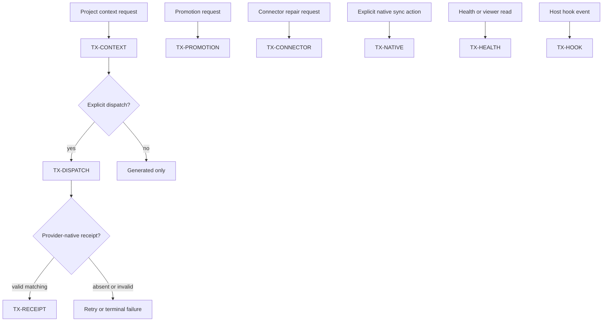
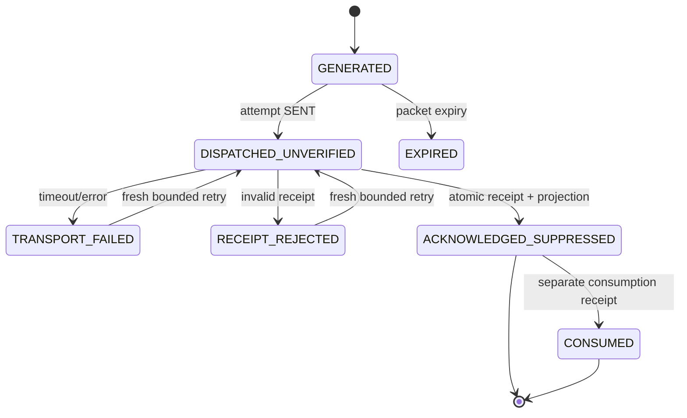
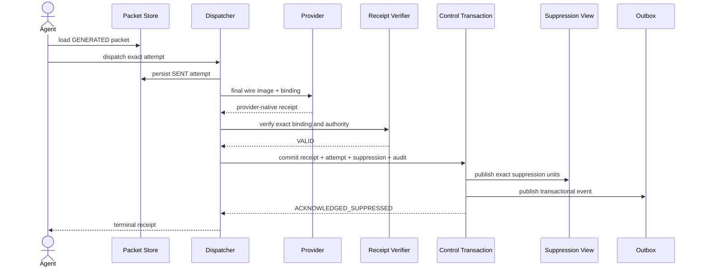
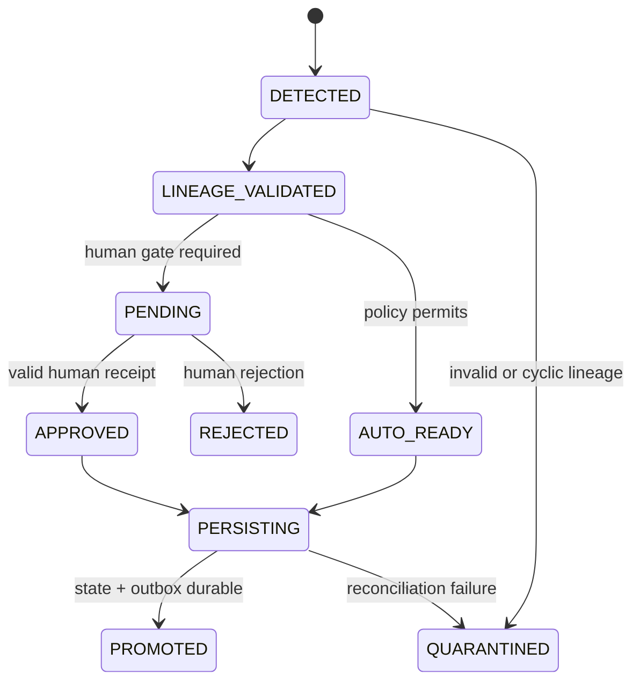
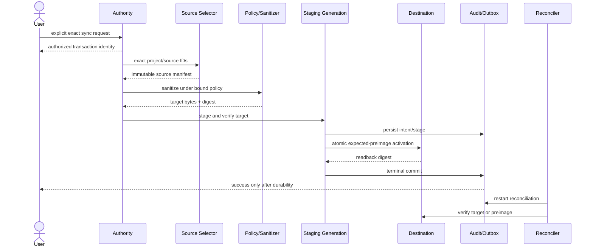
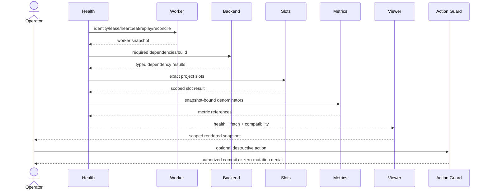

# DES-UCR-003 - Context Delivery, Promotion, and Provider Integration

## Document Control

| Field | Value |
|---|---|
| Artifact | DES-UCR-003 |
| Parent | `.aiwg/requirements/use-case-briefs/UC-003-context-promotion-provider.md` |
| Iteration | Agentmemory Elaboration iteration 2 / Iteration 4 evidence cycle |
| Date | 2026-07-26 |
| Status | **REVIEW CANDIDATE - BLOCKED - HUMAN ACCEPTANCE REQUIRED** |
| Construction | **NOT AUTHORIZED** |
| Architecture | Draft SAD; ADR-001 through ADR-007 remain **Proposed** |
| Candidate source | `[I-CANDIDATE]` commit `0e9af82dcfdf07dd1f521c4621823f31a9b2eaba` |
| External runtime | `[X-RUNTIME]` in-place fork-derived, upstream-labelled Agentmemory 0.9.28; not official npm and not current candidate HEAD |
| Sole write target | `.aiwg/requirements/realizations/DES-UCR-003.md` |

## 1. Decision Boundary

This realization reconciles the parent brief, the current 130-row
supplemental child-contract table, the canonical traceability and interface
matrices, the Draft SAD, Proposed ADR-001 through ADR-007, the risk record,
the three independent reviews, and the bounded evidence reports.

It is a design and acceptance candidate. It is not implementation, execution,
acceptance, release, deployment, or lifecycle-transition evidence.

The following controls are absolute:

1. Construction remains **NOT AUTHORIZED**.
2. ADR-001 through ADR-007 remain **Proposed**.
3. No risk is retired, mitigated, accepted, waived, rescored, or reprioritized.
4. No PoC result is admitted and no case card is authorized for execution.
5. The MTP and deterministic profiles remain human-unaccepted.
6. ABM remains FAIL / NO-GO.
7. No deployment, canary, migration, restore, connector apply, native sync,
   Railway operation, release, distribution, or rollout is claimed.
8. No exact provider-observed model, deployment, or route is claimed.
9. No `[X-RUNTIME]` observation proves `[I-CANDIDATE]` causation.
10. Codebase Memory coverage is best-effort metadata, not source completeness
    or runtime execution proof.

### 1.1 DEC-15 and DEC-16 Application

The
[Iteration 4 local macOS disposition](../../reports/iteration-4-local-macos-human-disposition-2026-07-28.md)
records **CRD-01 Option A selected** as DEC-15 and **CRD-02 Option A selected**
as DEC-16.

- DEC-15 permits the exact parent path
  [UC-003](../use-case-briefs/UC-003-context-promotion-provider.md), this
  realization, and the canonical
  [Requirements Traceability Matrix](../traceability-matrix.md) to satisfy
  Elaboration bidirectionality when the documentary chain is independently
  graph-verified. Live source and test annotations remain Construction work.
  This propagation does not claim that verification or accept the links.
- DEC-16 fixes the complete significant-use-case denominator at
  `DES-UCR-001..003`, tailors MIC and PSC out, and requires this realization
  independently to satisfy at least 22 of the following 27 frozen binary
  behavioral units:

```text
UC3-S01, UC3-S02, UC3-S03, UC3-S04, UC3-S05, UC3-S06, UC3-S07,
UC3-S08, UC3-S09, UC3-S10, UC3-S11, UC3-S12, UC3-S13, UC3-S14,
UC3-S15, UC3-S16, UC3-S17, UC3-S18, UC3-S19, UC3-S20, UC3-S21,
UC3-S22, UC3-S23, UC3-S24, UC3-S25, UC3-S26, UC3-S27
```

The threshold is `ceil(0.80 * 27) = 22`. A unit scores `1` only when an
independent review confirms its explicit behavioral contract, requirement
link, expected result, forbidden result or side effect, and evidence target;
otherwise it scores `0`. Presence in this file is not a pass. No unit or this
realization is accepted by the selection or this propagation, and no Stage A,
ABM, or Construction status follows.

## 2. Evidence and Authority Labels

| Label | Meaning | Permitted use |
|---|---|---|
| `[I-CANDIDATE]` | Direct candidate source at the named commit | Describe bounded implementation facts and gaps only |
| `[X-RUNTIME]` | Point-in-time separately installed fork-derived, upstream-labelled runtime | Regression seed only; no official-upstream or candidate causation |
| `[P]` | Proposed requirement, ICM, SAD, ADR, schema, flow, or oracle | Design and human review input only |
| `[G]` | Human-gated, unresolved, unimplemented, unqualified, or unevidenced | Explicit blocker |
| `[A]` | Accepted authoritative evidence with named authority and immutable receipt | May support only the decision surface it explicitly accepts |

No `[A]` evidence currently accepts UC-003, the SAD, any ADR, any risk
disposition, the MTP, ABM, Construction, or release.

The 148-file manifest is canonical for test-file path/content denominator
comparison, but it is not a qualifying execution receipt. The historical
1,629-test result is provisional.

## 3. Umbrella Realization Model

UC-003 is an umbrella orchestration. It is not one transaction and does not
imply that context delivery invokes promotion, connector repair, native sync,
or health/viewer work.

### 3.1 Independently atomic subtransactions

| Transaction | Actor and trigger | Authority | Atomic boundary | Success postcondition | Failure postcondition |
|---|---|---|---|---|---|
| `TX-CONTEXT` | Agent/provider adapter requests project context | Project context capability | Policy snapshot through immutable packet commit | One `GENERATED` packet and receipts | No packet, egress, acknowledgement, suppression, promotion, connector, or native effect |
| `TX-DISPATCH` | Provider adapter dispatches one named packet attempt | `context.dispatch` for exact packet/project/session/provider | Attempt reservation through terminal transport outcome | One durable attempt state | Packet remains generated; zero suppression; retry follows policy |
| `TX-RECEIPT` | Provider returns one native receipt | `context.acknowledge` for exact attempt | Receipt acceptance, exact suppression projection, audit lineage, and outbox in one control-plane commit | Observable `ACKNOWLEDGED_SUPPRESSED` projection | Zero new acknowledgement/suppression/consumption |
| `TX-PROMOTION` | Authorized actor evaluates one candidate | `promotion.evaluate` and any separate human authority | Eligibility decision or lifecycle transition plus outbox | One typed eligibility and one separate lifecycle disposition | Candidate remains unchanged or enters typed quarantine/rejection |
| `TX-CONNECTOR` | Operator requests repair of one named provider file | `connector.repair` for exact file/adapters | Preimage, staged owned-region change, verify, activate, audit, and rollback record | Exact target file plus terminal receipt | Byte/metadata-identical preimage or review-needed state |
| `TX-NATIVE` | User explicitly authorizes one native sync | Single-use `native.sync` for exact project/source/destination | Intent, stage, verify, activation, audit/outbox, readback, terminal result | Exact target durable at every governed effect | Byte-identical preimage and attributable failed result |
| `TX-HEALTH` | Operator/viewer requests project health or view | Read capability for exact project and snapshot | One immutable read snapshot | Typed health/viewer result with scope and denominator | Typed fetch/read failure; no mutation |
| `TX-HOOK` | Host emits one governed hook event | Hook capability for exact event/project/session | Durable intake identity through one terminal disposition | Exactly one terminal governed outcome | Typed rejected/dropped/failed outcome; bounded replay only |

No transaction above commits another transaction's domain effects unless an
explicit interface contract names that dependency. In particular:

- `TX-CONTEXT` does not dispatch automatically.
- `TX-DISPATCH` does not acknowledge or suppress.
- `TX-RECEIPT` does not prove consumption.
- `TX-PROMOTION` does not alter accepted ADR or human-decision authority.
- `TX-CONNECTOR` authorizes zero native-memory writes.
- `TX-NATIVE` is never triggered by hooks, compaction, restart, promotion,
  connector repair, configuration presence, or API enablement alone.
- `TX-HEALTH` is read-only.

### 3.2 Invocation relationships



This diagram expresses orchestration only. Each box retains its own actor,
authorization, transaction identity, retry policy, and success/failure state.

## 4. External Preconditions and Out-of-Flow Contracts

The following are prerequisites or adjacent release contracts, not UC-003
flow coverage:

| External contract | Relationship | Trace/control | Status |
|---|---|---|---|
| Canonical project/worktree identity and alias ownership | Required before any project policy or source access | `TR-UCM-001`, `ICM-01`; FR-01.a-e, FR-02.a-b/d | `[P][G]` |
| Immutable session scope/privacy/external-processing binding | Required before candidate-source access | `TR-UCM-004`, `ICM-04`; FR-06.e-g | `[P][G]` |
| Capture admission and all-sink privacy | Supplies admissible source records | `TR-UCM-003/010`, `ICM-03/10`; FR-07.e-f | `[P][G]` |
| Durable exact-event identity and compaction generation | Supplies trustworthy source/provenance generations | `TR-UCM-017`, `ICM-17`; FR-05.c-d, FR-08.c | `[P][G]` |
| Migration and exact restore | Release/recovery prerequisite only; no UC-003 actor flow | `TR-UCM-013`, `ICM-13`; FR-02.c-d and FR-19.b-c only as applicable to that external operation | `[P][G]` |
| Deterministic evidence profile | Qualification prerequisite | `TR-UCM-016`, `ICM-16`; NFR-12.a-b | `[P][G]` |
| Local macOS package and lifecycle | Release/qualification prerequisite; no automatic UC-003 transaction | `TR-UCM-019`, Draft `ICM-19`; FR-21.a-g | `[P][G]`; `T-LOCAL-DEPLOY` not admitted or run |
| Railway containment | External security/release gate | R-02, R-14, R-12 | `[G]` |
| Codebase Memory alias equivalence | External interoperability contract | `TR-UCM-015`, `ICM-15`; R-10 | `[P][G]` |

This realization does not directly map its eight core transactions to
`ICM-13` or claim FR-02 migration/restore acceptance. `TX-NATIVE` and
compaction may use immutable-generation mechanics without claiming migration
or restore coverage.

### 4.1 Local macOS applicability and behavior

`CR-AM-LOCAL-001` selects `deployment_target=local-macos`, while
`IA-AM-LOCAL-001` remains an advisory impact candidate. Under
`FR-15.a/g/h`, target and processing mode are independent: explicit
`zero-egress` permits zero external content-processing attempts; explicit
`provider-enabled` permits only the manifest-listed, project/session-bound
provider/destination/purpose/data class after minimization and redaction; and
missing or ambiguous mode fails closed.

`FR-20.l` prevents local-core readiness, provider-feature readiness, configured
processing mode, and observed external-processing state from substituting for
one another. `FR-21.a-g` are adjacent local lifecycle prerequisites linked by
`TR-UCM-019` / Draft `ICM-19` to `T-LOCAL-DEPLOY`: `LQ-001..007` cover the
package/service/bind/auth/identity foundation, `LQ-008..010` owned
Codex/Claude integration and isolation, `LQ-011/012` both processing policies,
and `LQ-013/014` exact recovery, rollback subject, separately authorized
switch, uninstall, support, and health. They do not become UC-003 transaction
successes and remain `NOT RUN / BLOCKED`.

Operator-supplied live MCP/Doctor diagnostics recorded in the canonical RTM are
`[X-RUNTIME]` regression seeds only. Healthy top-level checks coexist with
project slot list/get HTTP 500 and a 2-of-2 latest-durable-memory unscoped
warning; their distinct denominators are preserved as a truthful-degradation
gap. No session content is quoted, no LQ execution is inferred, and no heal or
migration was authorized or run.

## 5. Project Scope and Pre-Access Admission

### 5.1 Ordinary UC-003 scope

Ordinary UC-003 context is strictly project-scoped.

- `ContextRequest.scope` is exactly `project`.
- `ContextPacket.scope` is exactly `project`.
- Every candidate, result, omission, packet, attempt, receipt, suppression
  unit, metric, and viewer row binds one canonical project.
- A project packet may never carry `scope=global`.
- A global record may never be coerced, inherited, copied, summarized, or
  counted into a project packet.
- Missing, unresolved, ambiguous, conflicting, or mismatched project identity
  fails closed before any candidate source is opened.

Explicit global administration is a separate authorized operation/use case.
It is never a fallback, retry mode, compatibility mode, default viewer mode,
or context packet mode.

### 5.2 Metadata-only pre-access gate

Before opening, reading, deserializing, hashing content, logging content,
queueing content, ranking content, or tokenizing content, the service resolves:

1. canonical project and worktree ownership;
2. immutable session identity and lifecycle version;
3. authoritative privacy policy;
4. authoritative external-processing policy;
5. source class and exact source locator;
6. required versus human-classified optional-advisory status;
7. principal, capability, operation, and resource authority;
8. policy/version/digest freshness;
9. source-access authorization; and
10. exclusion and sink policy.

Any absent, stale, conflicting, unowned, or indeterminate gate-critical value
denies content access.

### 5.3 Content qualification order

After the metadata-only gate authorizes content access, evaluation order is
fixed:

```text
scope
-> authority
-> temporal validity
-> provenance
-> exclusion/privacy
-> completeness
-> exact-session acknowledged history
-> relevance
```

No relevance score can override an earlier failure.

Redaction/exclusion is applied before every serialization, fingerprint,
dedupe material, log, queue, retry state, ranker input, tokenizer input,
packet, provider attempt, native attempt, audit value, viewer/API value,
export, snapshot, backup, temporary file, receipt, or failure remnant.

## 6. Context Packet Contract

### 6.1 Concise schemas

```text
ContextRequest {
  request_id, actor_id, project_id, worktree_uuid, session_id,
  lifecycle_version, scope="project", operation="context.build",
  capability_id, policy_snapshot_id, tokenizer_profile_id,
  relevance_profile_id, nonce, issued_at, expires_at
}
```

```text
SourcePolicyDecision {
  source_locator, source_class, requiredness,
  policy_id, policy_version, policy_digest, policy_owner,
  access=ALLOW|DENY, omission_authority,
  privacy=ALLOW|REDACT|EXCLUDE|INDETERMINATE,
  external_processing=LOCAL_ONLY|DECLARED_PROCESSOR|DENY,
  reason_codes[], decided_at
}
```

```text
QualifiedSourceRecord {
  source_record_id, source_revision_digest, project_id,
  source_class=SLOTS_PROFILE|LESSONS|EPISODIC|FILE_HISTORY,
  authority_class, temporal_state, provenance_state,
  privacy_receipt_id, completeness=COMPLETE,
  acknowledged_for_exact_session=false,
  relevance_score, relevance_profile_id, qualification_receipt_id
}
```

```text
Omission {
  source_locator, source_record_id?, source_revision_digest?,
  stage=SCOPE|AUTHORITY|TIME|PROVENANCE|PRIVACY|COMPLETENESS|
        ACK_HISTORY|RELEVANCE|PACKING,
  reason_code, policy_digest, byte_count=0, token_count=0
}
```

```text
ContextPacket {
  packet_id, generation_id, project_id, session_id, scope="project",
  policy_snapshot_id, tokenizer_profile_id, tokenizer_build_id,
  relevance_profile_id, source_units[0..5], omissions[],
  wire_image_digest, actual_token_count, per_class_token_count,
  created_at, expires_at, nonce, state=GENERATED
}
```

### 6.2 Exact FR-09 packing profile

Token counts apply to the final serialized wire image after sanitization,
labels, truncation markers, separators, and provenance.

| Source class | Fixed maximum actual tokens |
|---|---:|
| Slots/profile | 300 |
| Lessons | 400 |
| Episodic results | 700 |
| File history | 400 |
| Provenance | 200 |
| Total | 2,000 |

Rules:

1. The accepted tokenizer/profile and tokenizer build perform the count.
2. Character estimates do not establish compliance.
3. Unused capacity is not silently moved between classes.
4. At most five distinct qualified retrieved source records are included.
5. Fixed identity/profile envelope fields do not count as retrieved records,
   but their tokens count toward the final 2,000-token wire image.
6. Duplicate source-record IDs are removed before packing.
7. A source below the accepted relevance threshold contributes zero bytes and
   receives `OMIT_LOW_RELEVANCE`.
8. A source acknowledged for the exact project/session and matching
   suppression unit contributes zero bytes and receives
   `OMIT_ACKNOWLEDGED_EXACT_SESSION`.
9. An indivisible item that cannot fit its class maximum is omitted unless the
   accepted profile permits deterministic token-boundary truncation.
10. Any post-count transformation requires a final recount; overflow rejects
    or deterministically repacks the packet.

`[G]` Tokenizer identity, relevance threshold, tie-breaking corpus, and
truncation profile require human acceptance.

### 6.3 Context build transaction

| Phase | Permitted effects | Commit rule |
|---|---|---|
| Pre-access admission | Metadata-only policy/authority lookups | No candidate content read |
| Candidate access | Policy-authorized source reads into bounded taint envelope | No persistence outside transaction workspace |
| Qualification | Exclusion decisions and typed source outcomes | No rank before all prior gates |
| Packing | Sanitized final wire image and omission list | Final actual-token recount |
| Commit | Packet, source units, omissions, privacy receipt, outbox | One immutable `GENERATED` generation |
| Abort | At most one bounded denial receipt | Zero packet/provider/suppression/promotion/native/connector domain effect |

## 7. Delivery, Receipt, Suppression, Retry, and Consumption

### 7.1 Delivery schemas

```text
DispatchAttempt {
  attempt_id, packet_id, project_id, session_id, provider_id,
  operation="context.dispatch", request_digest, packet_wire_digest,
  nonce, policy_snapshot_id, attempt_number, retry_group_id,
  started_at, expires_at,
  state=RESERVED|SENT|TRANSPORT_FAILED|RECEIPT_REJECTED|
        ACKNOWLEDGED_SUPPRESSED|CLOSED_SUPERSEDED|EXPIRED
}
```

```text
ProviderReceipt {
  receipt_id, receipt_version, packet_id, attempt_id,
  project_id, session_id, provider_id, context_digest, nonce,
  issuer_id, key_id, operation="context.acknowledge",
  registry_generation, issued_at, expires_at, signature
}
```

```text
SuppressionUnit {
  project_id, session_id, source_record_id, source_revision_digest,
  inclusion_kind=FULL_RECORD|TRUNCATED_FRAGMENT,
  wire_fragment_digest, fragment_descriptor?,
  packet_id, accepted_attempt_id, accepted_receipt_id
}
```

```text
ConsumptionReceipt {
  consumption_id, packet_id, attempt_id, project_id, session_id,
  provider_id, issuer_id, operation="context.consume",
  evidence_type, consumed_at, signature, verifier_receipt_id
}
```

### 7.2 One closed receipt model

Receipt verification requires an exact match on packet, attempt, project,
session, provider, final context digest, nonce, issuer, key purpose, operation,
registry generation, validity window, and current revocation/replay state.

The only successful receipt commit is:

```text
accept receipt
+ close matching attempt
+ close sibling attempts as superseded where policy requires
+ commit exact suppression units
+ append audit lineage
+ enqueue transactional outbox
= one control-plane transaction
```

The externally readable state is `ACKNOWLEDGED_SUPPRESSED`. Acknowledgement and
suppression remain analytically distinct fields, but no reader, health
collector, viewer, retry selector, or recovery worker may observe accepted
acknowledgement without its committed suppression projection.

### 7.3 Receipt and retry transition table

| Event | Matching attempt result | Sibling result | Suppression | Retry | Consumption |
|---|---|---|---|---|---|
| Valid current receipt | `ACKNOWLEDGED_SUPPRESSED` | Close eligible siblings as `CLOSED_SUPERSEDED` | Commit exact units once | Closed for acknowledged units | Unchanged |
| Exact duplicate valid receipt | Return existing terminal result | Unchanged | Zero additional units | Unchanged | Unchanged |
| Late receipt for already superseded attempt | Return existing superseded terminal result | Unchanged | Zero | Unchanged | Unchanged |
| Wrong packet/project/session/provider/hash/nonce | `RECEIPT_REJECTED` | Unchanged | Zero | Matching policy may permit fresh attempt | Unchanged |
| Wrong issuer/key/operation/generation | `RECEIPT_REJECTED` | Unchanged | Zero | Matching policy may permit fresh attempt | Unchanged |
| Expired receipt or attempt | `EXPIRED` | Unchanged | Zero | Fresh immutable attempt only | Unchanged |
| Revoked receipt authority | `RECEIPT_REJECTED` | Unchanged | Zero | Fresh authority required | Unchanged |
| Replayed receipt ID | Return prior terminal result or reject replay | Unchanged | Zero additional | Unchanged | Unchanged |
| Transport timeout/error | `TRANSPORT_FAILED` | Unchanged | Zero | Bounded retry if packet unexpired | Unchanged |
| No receipt | Remains sent until timeout, then terminal policy | Unchanged | Zero | Bounded retry if eligible | Unchanged |
| Valid consumption receipt | Unchanged | Unchanged | Unchanged | Unchanged | Commit separate `CONSUMED` evidence |

Retry is bounded by the human-accepted maximum attempts, backoff schedule,
packet expiry, capability expiry, and retry-group identity. Retry creates a new
attempt ID and nonce; it never mutates an old attempt into a new one.

### 7.4 Source unit and truncation semantics

1. A complete included record suppresses only its exact immutable
   `source_record_id + source_revision_digest`.
2. A deterministically truncated representation additionally binds the exact
   fragment digest and descriptor.
3. A later source revision is not suppressed by an earlier revision.
4. A non-overlapping fragment is not silently suppressed by a prior truncated
   fragment.
5. A partial or incomplete candidate source is not qualified and cannot enter
   the packet.
6. Packet truncation never converts an incomplete source into a complete one.
7. Acknowledgement never proves provider consumption.

### 7.5 State diagram



No state named `ACKNOWLEDGED` is externally observable without the matching
suppression projection.

### 7.6 Receipt sequence



Participant count: 8.

## 8. No-Domain-Write and Denial Receipt Contract

No governed domain side effect is distinct from the permitted denial ledger.

```text
NoDomainWriteOutcome {
  operation_id, project_id?, request_digest,
  denial_code, policy_digest?, decided_at,
  domain_attempted=0, domain_committed=0,
  provider_attempted=0, native_attempted=0,
  denial_receipt_attempted=0|1,
  denial_receipt_committed=0|1
}
```

| Outcome | Packet/source/suppression/promotion/native/connector/project-domain effect | Provider/local fallback | Control-plane denial receipt | Receipt failure behavior |
|---|---:|---:|---:|---|
| Disabled feature | 0 | 0 | At most one bounded redacted append | Denial remains denial |
| Missing/invalid authority | 0 | 0 | At most one bounded redacted append | Denial remains denial |
| Missing/stale privacy policy | 0 | 0 | At most one bounded redacted append | Denial remains denial |
| Required backend/source failure | 0 | 0 | At most one bounded redacted append | Failure remains failure |
| Protected proxy failure | 0 | 0 local fallback | At most one bounded redacted append | No fallback |
| Invalid receipt | 0 new domain effect | 0 | At most one bounded redacted append | No suppression |
| Unauthorized native sync | 0 | 0 native attempt | At most one bounded redacted append | No sync |
| Connector ownership ambiguity | 0 | 0 | At most one bounded redacted append | Preimage preserved |
| Unauthorized/stale viewer action | 0 | 0 | At most one bounded redacted append | No mutation |

The denial receipt contains no raw candidate content, secret, credential,
provider payload, native destination bytes, or unredacted configuration.

## 9. Promotion Contract

### 9.1 Schema

```text
PromotionCandidate {
  candidate_id, project_id, claim_digest, source_or_commit,
  policy_id, policy_digest,
  eligibility=ELIGIBLE|INELIGIBLE|INDETERMINATE,
  eligibility_reason_codes[],
  evidence_digests[], evidence_types[], independence_set[],
  lineage_dag_digest, human_gate_class,
  lifecycle_disposition=PENDING|AUTO_READY|APPROVED|REJECTED|
                        QUARANTINED|PERSISTING|PROMOTED,
  human_receipt_id?, canonical_authority_locator?,
  idempotency_key, outbox_id, created_at, updated_at
}
```

Eligibility and lifecycle disposition are independent fields. Neither may
substitute for the other.

### 9.2 Eligibility rules

- `ELIGIBLE`: every accepted evidence-type, authority, temporal, provenance,
  privacy, completeness, and independence rule is satisfied.
- `INELIGIBLE`: a definitive exclusion applies.
- `INDETERMINATE`: required evidence or policy cannot be resolved.
- Gate-critical `INDETERMINATE` fails closed.
- Recalled, summarized, paraphrased, derived, cyclic, locator-only, or
  semantically duplicate content cannot corroborate itself or descendants.
- Independent corroborating sources remain distinct even when content is
  similar.
- Evidence policy is versioned; this realization does not hard-code
  failure-plus-pass evidence for every class.
- Architecture, security, business, and user-preference classes retain their
  required human gates.
- A promoted memory never becomes the accepted ADR, human decision, policy,
  or release authority.

### 9.3 Promotion state machine



`[G]` Accepted evidence types, independence algorithm, human-gate classes,
withdrawal/supersession rules, and human authorities remain unresolved.

## 10. Connector Repair and Custody

### 10.1 Connector transaction schema

```text
ConnectorRepairRequest {
  transaction_id, actor_id, provider_id, adapter_id,
  file_identity, expected_preimage_digest, ownership_policy_id,
  requested_owned_entry_ids[], adoption_receipt_ids[],
  capability_id, nonce, issued_at, expires_at
}
```

```text
ProviderFileManifest {
  path_identity, file_type, bytes_digest, byte_count,
  owner_id, group_id, mode, symlink_state, link_target?,
  xattrs_digest, ordered_entry_digest, sensitive_field_classes[],
  captured_at
}
```

### 10.2 Ownership and adoption

1. Only an immutable accepted Agentmemory ownership marker with exact entry ID
   and schema version authorizes mutation.
2. Legacy entries require a separate explicit adoption receipt.
3. Command/path resemblance, regex matching, package name similarity, and
   location alone do not prove ownership.
4. Ambiguous, malformed, legacy-unowned, or concurrently changed entries
   remain byte-identical and return `REVIEW_NEEDED`.
5. Unknown/unowned entries are preserved in original order.

### 10.3 Apply, verify, interruption, and rollback

| Phase | Required behavior |
|---|---|
| Read | Reject symlink/owner/type ambiguity under accepted policy |
| Plan | Bind exact preimage manifest and owned-region diff |
| Backup | Policy-safe, restricted, content-addressed, sanitized, lifecycle-audited |
| Stage | Write complete target in same-filesystem staging location where applicable |
| Verify | Parse, ownership-check, compare unowned bytes/order/metadata |
| Activate | Atomic replacement under expected-preimage CAS |
| Reapply | Same request produces zero diff |
| Interrupt | Restart identifies transaction and converges to target or preimage |
| Rollback | Restore full bytes, permissions, ownership, xattrs where supported, and order |

Success means the complete target file and terminal audit/outbox are durable.
Configuration presence proves only configuration, not hook launch, durable
capture, dispatch, acknowledgement, suppression, consumption, or native sync.

## 11. Explicit Native Synchronization

Native synchronization is a separate user-authorized transaction.

### 11.1 Request and plan

```text
NativeSyncRequest {
  transaction_id, actor_id, project_id, scope="project",
  immutable_source_ids[], source_generation_id,
  destination_id, destination_policy_id,
  expected_preimage_digest, capability_id,
  operation="native.sync", nonce, issued_at, expires_at
}
```

```text
NativeSyncPlan {
  transaction_id, exact_source_manifest_digest,
  sanitized_target_digest, destination_id,
  preimage_digest, staging_identity,
  activation_method, verification_method,
  audit_outbox_id, rollback_method
}
```

```text
NativeSyncReceipt {
  transaction_id, actor_id, project_id,
  exact_source_manifest_digest, destination_id,
  preimage_digest, target_digest,
  activation_digest?, readback_digest?,
  audit_outbox_id, terminal=COMMITTED|ROLLED_BACK|FAILED,
  failure_code?, started_at, completed_at
}
```

### 11.2 Zero automatic paths

The following authorize exactly zero native writes:

- session end;
- pre-compaction or compaction;
- capture or recall;
- promotion;
- worker/service restart;
- connector repair;
- feature-flag or destination configuration;
- API route availability;
- provider authentication;
- health recovery; and
- retry of an unrelated operation.

### 11.3 Transaction protocol

1. Verify actor, exact project, operation/resource-bound capability, nonce,
   time, revocation, destination ownership, and expected preimage.
2. Resolve only the named immutable source IDs.
3. Reject global, other-project, legacy-unscoped, unlisted, derived-only,
   incomplete, privacy-ineligible, or changed source records.
4. Sanitize under the bound policy before target serialization.
5. Stage a versioned target image.
6. Verify target bytes, source manifest, policy, destination, and target digest.
7. Persist intent, stage, and transactional audit/outbox state.
8. Activate the destination atomically under expected-preimage CAS.
9. Read back and verify the activated target.
10. Commit the terminal audit/outbox and success result.

Success is impossible until the exact target and all governed effects are
durable.

Every write, fsync, rename, activation, audit, outbox, readback, verification,
or process-death fault must converge after restart to:

- committed exact target with matching terminal receipt; or
- byte-identical preimage with one attributable failed/rolled-back receipt.

No mixed target, fabricated success, orphan stage, unrecorded backup, or
cross-destination effect is permitted.

### 11.4 Native sync sequence



Participant count: 8.

## 12. Durable Hook Delivery and Worker Recovery

### 12.1 Event and worker schemas

```text
HookEvent {
  event_id, attempt_id, project_id, session_id,
  event_class, payload_digest, policy_digest,
  accepted_at, state=QUEUED|CLAIMED|RETRY_WAIT|
                     DELIVERED|REJECTED|DROPPED|FAILED
}
```

```text
WorkerGeneration {
  worker_generation_id, supervisor_id, lease_id,
  fencing_token, process_identity, build_id,
  heartbeat_sequence, heartbeat_at,
  intake_ready, replay_cursor, checkpoint_digest,
  backlog_count, oldest_event_age,
  reconciliation_manifest_digest
}
```

Host-visible durable acceptance occurs only after the immutable event/attempt
identity is committed and recoverable by a newly started worker.

### 12.2 Terminal disposition equation

For every admitted event `e`:

```text
terminal(e) =
  count(DELIVERED(e)) +
  count(REJECTED(e)) +
  count(DROPPED(e)) +
  count(FAILED(e))

terminal(e) == 1
```

`QUEUED`, `CLAIMED`, and `RETRY_WAIT` are non-terminal transitions.
Delivery-failure telemetry creates zero recursive hook events.

### 12.3 Singleton and fencing

- One supervisor owns one worker generation.
- The active lease and fencing token are required for every state mutation.
- Stale/reused PID, expired lease, corrupt PID file, missing PID file, delayed
  old-worker write, and dual start cannot regain mutation authority.
- A process or port being alive is not worker readiness.
- Replay is bounded by exact accepted attempt/time/backoff limits.
- Exhausted or poison events enter a typed terminal/quarantine policy without
  blocking unrelated events.

### 12.4 Startup reconciliation

Before readiness can recover, the worker compares one manifest covering:

1. immutable intake events;
2. event claims and checkpoints;
3. terminal dispositions;
4. sessions and lifecycle generations;
5. observations and summaries;
6. exact-facts ledgers;
7. search/vector indexes;
8. counts and streams;
9. audit/outbox events;
10. provider attempts;
11. suppression projections; and
12. delivery queue/backlog state.

Reconciliation succeeds only when every accepted event is represented by
exactly one terminal result or one attributable non-terminal replay unit, and
all declared side-effect generations agree.

Readiness remains `UNAVAILABLE` or `RECOVERING` until equality is established.

## 13. Health and Viewer Contracts

### 13.1 Exact health states

Health state is exactly:

```text
HEALTHY | DEGRADED | RECOVERING | UNAVAILABLE
```

```text
UNKNOWN/UNAVAILABLE/DEGRADED -> RECOVERING  first complete success
RECOVERING -> RECOVERING                    second complete success
RECOVERING -> HEALTHY                       third complete success
HEALTHY -> DEGRADED                         optional advisory failure/pressure
HEALTHY/DEGRADED/RECOVERING -> UNAVAILABLE required failure/stale/timeout
RECOVERING -> DEGRADED                      optional advisory failure
```

Any failed probe resets the recovery streak. `RECOVERING` is non-healthy.
Required failure maps to unavailable/HTTP 503 within the accepted probe
interval. Exact interval and TTL remain human-gated.

### 13.2 Viewer fetch and compatibility

Viewer fetch state is exactly:

```text
OK | UNAUTHORIZED | TIMEOUT | TRANSPORT_ERROR | MALFORMED | STALE
```

Compatibility is separately:

```text
COMPATIBLE | INCOMPATIBLE | NOT_EVALUATED
```

A build mismatch is `INCOMPATIBLE`, not transport unavailability.
Unavailable/stale/malformed authenticated health cannot render as healthy.
Last-known-good data is visibly stale with its observation time.

### 13.3 Snapshot schema

```text
HealthSnapshot {
  snapshot_id, sequence, project_id, scope="project",
  captured_at, expires_at, observation_window,
  health_state, liveness, readiness, pressure,
  required_dependency_results[],
  recovery_success_streak,
  backend_build_id, viewer_build_id,
  viewer_fetch_state, compatibility,
  worker_generation_id, heartbeat_at,
  backlog_count, replay_cursor,
  reconciliation_manifest_digest,
  slot_result, metric_refs[]
}
```

```text
MetricSnapshot {
  metric_id, project_id, scope="project",
  numerator, denominator, exclusions[],
  threshold?, corpus_or_profile_id?,
  snapshot_id, sequence, observation_window, captured_at
}
```

Every viewer counter displays exact scope, named denominator, snapshot ID,
observation time, exclusions, and build identity before use.

### 13.4 Project viewer isolation and actions

Project view contains zero global or other-project durable data, whether raw,
derived, counted, summarized, cached, stale, or error-rendered.

Explicit global view is a separate short-lived authorized administration
operation and is visibly labelled. It is never inferred from a missing project.

```text
ViewerAction {
  action_id, actor_id, capability_id,
  scope=project|explicit_global,
  project_id?, operation, resource_id,
  expected_snapshot_id, expected_version,
  nonce, issued_at, expires_at
}
```

Every destructive action revalidates actor/capability, exact scope, project,
operation, resource, expected snapshot/version, nonce, time, and revocation.
Stale, mismatched, replayed, project-plus-global, or unauthorized action
changes zero state and may append only the bounded denial receipt.

### 13.5 Health/viewer sequence



Participant count: 8.

## 14. Degradation and Protected Failure

Degradation is allowed only when a human-accepted policy classifies the exact
source as optional advisory for the exact operation/context class.

| Uncertainty/failure | Result |
|---|---|
| Required source unavailable, stale, partial, unknown, or policy-missing | `UNAVAILABLE` / fail closed |
| Privacy or exclusion uncertainty | Fail closed |
| Project/scope/authority uncertainty | Fail closed |
| Protected proxy error or backend authority failure | Fail closed; zero local fallback |
| Gate-critical dependency failure | Fail closed |
| Human-classified optional advisory `DISABLED/NOT_REQUESTED` | Typed omission; completeness false |
| Human-classified optional advisory `TIMEOUT/ERROR` | `DEGRADED`; completeness false |

Every source outcome binds policy ID/version/digest, owner, operation/context
class, requiredness, omission authority, item count, latency, timestamp, and
reason.

A degraded packet:

- is visibly `DEGRADED`;
- is advisory only;
- is non-promotable;
- cannot serve gate-critical authority;
- cannot be silently reclassified as complete;
- cannot invoke local fallback after protected proxy failure; and
- preserves R-18 no-fallback semantics.

## 15. Exact Requirement, Trace, Interface, and Risk Mapping

The current supplemental specification explicitly inventories 130 unique child
contracts. This realization maps only exact applicable children per section.

Mappings below are exact applicable sets, not blanket parent ranges.

| Realization section/transaction | Exact child contracts | Trace / ICM | Risks |
|---|---|---|---|
| Scope and pre-access admission | FR-03.b, FR-03.c, FR-06.e, FR-07.e, FR-07.f, FR-15.a, FR-15.f, FR-15.g, FR-15.h, FR-16.b, NFR-01.a, NFR-02.a, NFR-03.a | TR-UCM-002/003/004/009/010/014; ICM-02/03/04/09/10/14 | R-01, R-02, R-03, R-14, R-15, R-17, R-20 |
| `TX-CONTEXT` qualification | FR-04.a, FR-04.b, FR-09.a, FR-09.b, FR-09.e, FR-09.f, FR-09.g, FR-10.a, FR-10.b, FR-19.b, FR-19.c, FR-19.e, NFR-05.a, NFR-08.a | TR-UCM-005/007/009/012; ICM-05/07/09/12 | R-03, R-06, R-09, R-13, R-17 |
| `TX-DISPATCH` | FR-09.d, FR-11.a, FR-11.b, FR-15.a, FR-15.f, FR-15.g, FR-15.h, FR-19.b, FR-19.c, FR-19.d, FR-19.e | TR-UCM-003/006/009/010/014; ICM-03/06/09/10/14 | R-04, R-14, R-15, R-17, R-18 |
| `TX-RECEIPT` | FR-09.c, FR-09.d, FR-11.c, FR-11.d, FR-11.e, FR-12.d, FR-19.e | TR-UCM-006/009; ICM-06/09 | R-04, R-13, R-14, R-17, R-20 |
| `TX-PROMOTION` | FR-10.a, FR-10.b, FR-10.c, FR-10.d, FR-13.a, FR-13.b, FR-13.c, FR-13.d, FR-13.e | TR-UCM-007/008; ICM-07/08 | R-03, R-05, R-06, R-17, R-21, R-22 |
| `TX-CONNECTOR` | FR-17.a, FR-17.b, FR-17.c, FR-17.d, FR-17.e, FR-17.f, FR-19.e | TR-UCM-009/014; ICM-09/14 | R-02, R-07, R-11, R-23 |
| `TX-NATIVE` | FR-14.a, FR-14.b, FR-14.c, FR-14.d, FR-14.e, FR-15.a, FR-15.e, FR-15.f, FR-19.e, NFR-01.a, NFR-02.a | TR-UCM-009/010/018; ICM-09/10/18 | R-01, R-02, R-14, R-15, R-16 adjacent, R-19 |
| `TX-HOOK` and worker | FR-18.a, FR-18.b, FR-18.c, FR-18.d, FR-18.e, FR-18.f, FR-18.g, FR-18.h, FR-20.g, FR-20.h, NFR-09.a | TR-UCM-011/014; ICM-11/14 | R-07, R-08, R-13, R-21, R-23 |
| `TX-HEALTH` and viewer | FR-03.b, FR-03.c, FR-12.b, FR-12.c, FR-12.d, FR-12.e, FR-12.f, FR-20.a, FR-20.b, FR-20.c, FR-20.d, FR-20.e, FR-20.f, FR-20.g, FR-20.h, FR-20.i, FR-20.j, FR-20.k, FR-20.l, NFR-01.a, NFR-04.a, NFR-11.a, NFR-11.b | TR-UCM-002/011/012; ICM-02/11/12 | R-01, R-07, R-08, R-09, R-14, R-23 |
| Qualification boundary | NFR-12.a, NFR-12.b | TR-UCM-016; ICM-16 | R-12, R-13 |
| Adjacent local macOS lifecycle | FR-21.a, FR-21.b, FR-21.c, FR-21.d, FR-21.e, FR-21.f, FR-21.g | TR-UCM-019; Draft ICM-19; `T-LOCAL-DEPLOY` / `LQ-001..014` | R-02, R-07, R-09, R-11, R-13, R-14, R-16, R-23; local R-01/R-08 obligations retain the exact P2 trace edges |
| Adjacent migration/restore prerequisite | FR-02.c, FR-02.d, FR-19.b, FR-19.c | TR-UCM-013; ICM-13 | R-16 |

FR-01.a-e, FR-02.a-b/d, FR-05.c-d, FR-06.e-g, FR-07.e-f, and FR-08.c are
upstream/adjacent input contracts where named. Their acceptance is not claimed
as UC-003 flow completion.

## 16. Deterministic Scenario and Oracle Catalog

Every row is a bidirectional design link: the scenario names exact obligations,
and Section 17 maps each obligation family back to its scenarios. `DQ` means
design-qualified only; every row remains `NOT RUN / BLOCKED`.

| ID | Deterministic precondition | Fault point or stimulus | Expected durable state | Forbidden state or side effect | Evidence target | Exact mapping | Qualification |
|---|---|---|---|---|---|---|---|
| UC3-S01 | Accepted project/session/privacy policy; five qualified sources | Build ordinary context | One project packet; ordered omissions; final wire <=2,000 actual tokens | `scope=global`; pre-gate read; sixth source | EV-CTX-01 packet bytes, token trace, access log | FR-03.b/c, FR-09.a/b/e/f/g; ICM-03/05/09; R-03/R-13 | DQ; NOT RUN / BLOCKED |
| UC3-S02 | Same-name repositories with distinct canonical project IDs | Caller supplies alias/path override | Authority-resolved project selected or request denied before reads | Cross-project merge or durable leakage | EV-ID-01 resolver decision and zero-read proof | FR-03.b/c, FR-15.a/f; ICM-02/03/10; R-01/R-20 | DQ; NOT RUN / BLOCKED |
| UC3-S03 | Valid project capability lacking global operation/resource grant | Request global scope | Separate administration operation denied | Global fallback or project packet with global data | EV-AUTH-01 capability decision | FR-15.a/f, FR-16.b; ICM-03/10; R-01/R-14/R-18 | DQ; NOT RUN / BLOCKED |
| UC3-S04 | Privacy policy unresolved | Candidate source exists | Admission fails before source open/read | Source bytes in cache, log, packet, metric, or model sink | EV-PRIV-01 syscall/source-access and sink ledger | FR-06.e, FR-07.e/f, FR-19.e; ICM-04/09; R-02/R-15/R-17 | DQ; NOT RUN / BLOCKED |
| UC3-S05 | All gates known; one source excluded and one exact-session acknowledged | Qualify then rank | Both omitted with typed reasons before relevance selection | Excluded or acknowledged record selected | EV-CTX-02 qualification trace | FR-09.c/e, FR-10.a/b; ICM-05/07; R-03/R-06 | DQ; NOT RUN / BLOCKED |
| UC3-S06 | Slot candidates exceed one fixed maximum | Serialize final sanitized wire image | Each slot <=300/400/700/400/200; total <=2,000 | Silent capacity shifting or pre-sanitization count | EV-TOK-01 accepted-tokenizer count and byte artifact | FR-09.a/b/f/g; ICM-05; R-13 | DQ; NOT RUN / BLOCKED; profile gate open |
| UC3-S07 | Six equally qualified retrieved records | Select sources | Stable tie-break returns at most five distinct source records | Fragment counting that admits sixth record | EV-SRC-01 source-unit selection trace | FR-09.e/f; ICM-05; R-03/R-13 | DQ; NOT RUN / BLOCKED |
| UC3-S08 | Packet committed; no valid receipt | Crash before provider call | `GENERATED`; no receipt/suppression | `ACKNOWLEDGED` or suppression | EV-DSP-01 transaction/outbox log | FR-09.d, FR-11.a/b; ICM-06; R-04/R-17 | DQ; NOT RUN / BLOCKED |
| UC3-S09 | Matching live attempt and issuer-bound receipt | Crash at receipt commit boundary | ACK projection and exact-source suppression both commit or neither commits | Observable ACK without suppression | EV-RCP-01 serializable history | FR-09.c/d, FR-11.c/d/e; ICM-06/09; R-04/R-20 | DQ; NOT RUN / BLOCKED |
| UC3-S10 | Accepted receipt already committed | Duplicate or replay arrives | Idempotent same terminal projection; audit records replay class | New suppression, reopened retry, or altered source unit | EV-RCP-02 replay transcript | FR-11.c/d/e; ICM-06; R-04/R-17 | DQ; NOT RUN / BLOCKED |
| UC3-S11 | Attempt superseded, expired, revoked, wrong issuer, or sibling | Receipt arrives | Rejected with typed reason; matching attempt remains unchanged | ACK/suppression from invalid receipt | EV-RCP-03 race matrix transcript | FR-11.c/d/e, FR-15.a/f; ICM-06/10; R-04/R-14/R-20 | DQ; NOT RUN / BLOCKED |
| UC3-S12 | Packet carries truncated representation of source | Valid receipt accepted | Suppress exact source revision/unit represented by packet policy | Whole lineage suppression or unsent-tail consumption claim | EV-RCP-04 source-unit projection | FR-09.c/d, FR-11.d/e; ICM-06; R-03/R-04 | DQ; NOT RUN / BLOCKED |
| UC3-S13 | Receipt accepted; provider emits separate consumption evidence | Consumption event matches packet/attempt | Consumption projection added without changing receipt truth | Receipt treated as proof of consumption | EV-RCP-05 receipt-versus-consumption ledger | FR-11.c/e; ICM-06; R-04 | DQ; NOT RUN / BLOCKED |
| UC3-S14 | Disabled, unauthorized, malformed, or policy-denied operation | Invoke governed write path | No governed domain write; at most one bounded redacted denial receipt | Memory/file/provider write; denial relaxation on receipt failure | EV-NW-01 domain diff plus denial-ledger fault injection | FR-15.a/f, FR-19.e; ICM-09/10; R-02/R-14/R-17 | DQ; NOT RUN / BLOCKED |
| UC3-S15 | Candidate has independent evidence set | Evaluate promotion | Eligibility exactly ELIGIBLE/INELIGIBLE/INDETERMINATE; separate lifecycle | Self-corroboration or eligibility encoded as lifecycle | EV-PRO-01 evidence graph and state record | FR-10.a-d, FR-13.a-e; ICM-07/08; R-05/R-06/R-21/R-22 | DQ; NOT RUN / BLOCKED |
| UC3-S16 | ELIGIBLE candidate but human gate absent | Request activation | Remains staged/pending disposition | Automatic durable promotion | EV-PRO-02 approval and storage diff | FR-13.b/c/d/e; ICM-08; R-05/R-21 | DQ; NOT RUN / BLOCKED |
| UC3-S17 | Managed connector with valid ownership marker and exact preimage | Apply then interrupt after staged write | Exact rollback restores bytes, mode, owner, xattrs, and order | Heuristic overwrite, unsafe backup, or mixed image | EV-CON-01 pre/post manifest and interruption matrix | FR-17.a-f; ICM-14; R-02/R-11/R-23 | DQ; NOT RUN / BLOCKED |
| UC3-S18 | Connector changed concurrently after adoption | Reapply | Conflict; no overwrite; preserved external bytes and metadata | Silent adoption or clobber | EV-CON-02 compare-and-swap trace | FR-17.b/c/e/f; ICM-14; R-11/R-23 | DQ; NOT RUN / BLOCKED |
| UC3-S19 | Exact actor/project/source/destination/policy/nonce/preimage; user authorizes once | Native sync and crash at each effect | Reconciliation reaches committed exact target or byte-identical preimage | Automatic path, partial success, cross-project target | EV-NAT-01 staged/activation/audit/outbox/verify crash matrix | FR-14.a-e, FR-15.e/f; ICM-09/10/18; R-01/R-02/R-19 | DQ; NOT RUN / BLOCKED |
| UC3-S20 | Native target durable but audit/outbox not durable | Success response attempted | No success; restart reconciles all governed effects | Success before audit/outbox/verification | EV-NAT-02 commit-fence trace | FR-14.c/d/e, FR-19.e; ICM-09/18; R-19 | DQ; NOT RUN / BLOCKED |
| UC3-S21 | Durable hook accepted; worker dies before terminal disposition | Restart with new fenced generation | Startup reconciliation replays bounded exact accepted item once to terminal equation | Lost item, concurrent generations, unbounded replay | EV-WRK-01 intake/death/restart ledger | FR-18.a-h, NFR-09.a; ICM-11/14; R-07/R-08/R-23 | DQ; NOT RUN / BLOCKED |
| UC3-S22 | Worker terminal disposition durable; delivery retry occurs | Duplicate accepted item | Idempotent terminal result; no repeated governed side effect | Double write or reopened terminal item | EV-WRK-02 duplicate/replay history | FR-18.b-e/g/h; ICM-11; R-07/R-23 | DQ; NOT RUN / BLOCKED |
| UC3-S23 | Exact project viewer capability and fresh scoped snapshot | Fetch and request destructive action | Enumerated fetch status; scope/denominator/time/build shown; exact-scope authorization enforced | Global/other-project durable data or stale destructive authorization | EV-VWR-01 response corpus and authorization trace | FR-20.a-k, NFR-11.a/b; ICM-11/12; R-01/R-09/R-14 | DQ; NOT RUN / BLOCKED |
| UC3-S24 | Optional advisory source is human-classified optional | Source times out | Visible DEGRADED result; required gates remain satisfied | Silent omission, promotion use, or fallback authority | EV-DEG-01 policy classification and health transition | FR-12.b-f, FR-20.a-f; ICM-12; R-08/R-09/R-18 | DQ; NOT RUN / BLOCKED |
| UC3-S25 | Required/privacy/scope/protected-proxy source uncertain | Failure or timeout | Fail closed as UNAVAILABLE/failed operation | DEGRADED success or local fallback | EV-DEG-02 no-fallback transcript | FR-12.d-f, FR-19.b-e; ICM-09/12; R-14/R-17/R-18 | DQ; NOT RUN / BLOCKED |
| UC3-S26 | Runtime regression seed uses frozen candidate plus external installed runtime | Compare observation | Results labelled by evidence subject; candidate causation remains NOT_EVALUATED | Live route treated as candidate proof | EV-REG-01 subject/build/hash envelope | NFR-12.a/b; ICM-16; R-12/R-13 | DQ; NOT RUN / BLOCKED |
| UC3-S27 | Compaction/native generation pattern has exact preimage | Crash before/after generation activation | One exact generation or byte-identical preimage | Migration/restore acceptance inference | EV-REC-01 generation recovery proof | FR-14.c-e; ICM-18; R-19; R-16 adjacent | DQ; NOT RUN / BLOCKED |

## 17. Reverse Oracle Index

| Obligation family | Required scenarios |
|---|---|
| Scope, identity, global separation, collision | UC3-S01, S02, S03, S19, S23 |
| Pre-access privacy, sink coverage, qualification order | UC3-S04, S05, S14, S25 |
| Packet source and actual-token bounds | UC3-S01, S06, S07 |
| Dispatch, receipt races, retry, suppression, consumption | UC3-S08, S09, S10, S11, S12, S13 |
| No-domain-write and denial receipt | UC3-S04, S14, S25 |
| Promotion vocabulary, independence, human gate | UC3-S15, S16 |
| Connector custody, concurrency, rollback | UC3-S17, S18 |
| Explicit native sync, recovery, exact preimage | UC3-S19, S20, S27 |
| Durable hooks, worker replay, readiness | UC3-S21, S22 |
| Health, viewer, degradation, destructive action | UC3-S23, S24, S25 |
| Runtime regression and evidence subject | UC3-S26 |

No requirement, ICM, risk, or scenario is satisfied merely by appearing in
either direction of this index.

## 18. Frozen Test Denominator and Evidence Subjects

The canonical test manifest contains exactly 148 files. Its filename-set hash is
`5f3f5736310cc634872622669452535fea6c6ce93b5abcfd88b5af981ec69550`;
its content hash is
`fe839458881bea1f8d937b1ee8cec1039e08d7431d794440278301730f435d33`.
The historical 1,629 result is provisional and is not acceptance evidence.

Revision 10 of the Iteration 4 input manifest passed local deterministic
verification, but it predates the executed temporary containment and the
Revision 11 documentary repairs. Revision 10 therefore remains a historical
pre-containment snapshot. Current review eligibility requires the exact
canonical manifest plus its matching passed receipt recorded at decision time.
Those post-generation identities are intentionally external to this
realization; review-time drift hashes are not hardcoded here as current
authority.

| Subject | Permitted claim |
|---|---|
| `[I-CANDIDATE]` | Candidate source behavior only, qualified by source/build hash |
| `[X-RUNTIME]` | External observation of the fork-derived installed runtime only; never official-upstream or current-HEAD proof |
| `[P]` | Proposed architecture/governance intent only |
| `[G]` | Human-gated or unresolved choice only |
| `[A]` | Explicitly accepted authoritative evidence only |

Live runtime observations cannot establish candidate causation, route identity,
MTP acceptance, or ABM passage.

## 19. Blocker Ledger

| ID | Open blocker | Required closure authority/evidence |
|---|---|---|
| BL-01 | Construction is not authorized | Human lifecycle gate |
| BL-02 | ADR-001..007 remain Proposed | Recorded ADR acceptance |
| BL-03 | Tokenizer, deterministic profile, thresholds, and allocation acceptance unresolved | Human acceptance plus frozen profile |
| BL-04 | Capability issuer/verifier and operation/resource grammar unaccepted | Security/architecture acceptance |
| BL-05 | Receipt issuer, source-unit, retry, revocation, replay, and consumption qualification absent | Admitted deterministic receipt evidence |
| BL-06 | Promotion independence and human-gate enforcement unqualified | Admitted promotion evidence |
| BL-07 | Connector custody/rollback and explicit native-sync crash convergence unqualified | Admitted fault matrix |
| BL-08 | Worker singleton, replay bound, terminal equation, reconciliation, and readiness unqualified | Admitted restart evidence |
| BL-09 | Viewer isolation, sustained health, degradation, and action authorization unqualified | Admitted scoped runtime evidence |
| BL-10 | Migration/restore release contracts remain external prerequisites | Separate release acceptance |
| BL-11 | This realization cannot self-bind a post-generation manifest and receipt | Decision record names and independently verifies the exact canonical manifest/receipt pair |
| BL-12 | Candidate and installed runtime evidence are not causally joined | Frozen candidate build and admitted execution |
| BL-13 | No PoC, MTP, ABM, deployment, or provider-observed exact-route acceptance exists | Authorized execution and human acceptance |
| BL-14 | Local package, LaunchAgent, protected local surfaces, owned integrations, exact lifecycle recovery, and official-upstream rollback subject have no admitted `T-LOCAL-DEPLOY` evidence | Human-accepted local profile, later B1/B2 authority, 42 retained journey executions, and independent disposition |

## 20. Mandatory Review Finding Disposition

`IC-RESOLVED / EXTERNAL-BLOCKED` means this document reconciles the internal
contract conflict; implementation and acceptance evidence remain absent. It is
not a finding closure, risk change, or authorization.

| Finding | Internal disposition | Remaining external blocker |
|---|---|---|
| F-01 | IC-RESOLVED / EXTERNAL-BLOCKED | Eight atomic subtransactions require acceptance evidence |
| F-02 | IC-RESOLVED / EXTERNAL-BLOCKED | Capability and collision evidence absent |
| F-03 | IC-RESOLVED / EXTERNAL-BLOCKED | Pre-access enforcement evidence absent |
| F-04 | IC-RESOLVED / EXTERNAL-BLOCKED | Tokenizer/profile human acceptance open |
| F-05 | IC-RESOLVED / EXTERNAL-BLOCKED | Receipt race/atomicity qualification absent |
| F-06 | IC-RESOLVED / EXTERNAL-BLOCKED | Denial-ledger fault evidence absent |
| F-07 | IC-RESOLVED / EXTERNAL-BLOCKED | Promotion evidence and human gate absent |
| F-08 | IC-RESOLVED / EXTERNAL-BLOCKED | Native-sync crash matrix absent |
| F-09 | IC-RESOLVED / EXTERNAL-BLOCKED | Connector custody evidence absent |
| F-10 | IC-RESOLVED / EXTERNAL-BLOCKED | Optional-source classification acceptance absent |
| F-11 | IC-RESOLVED / EXTERNAL-BLOCKED | Worker replay/readiness evidence absent |
| F-12 | IC-RESOLVED / EXTERNAL-BLOCKED | Viewer/health qualification absent |
| F-13 | IC-RESOLVED / EXTERNAL-BLOCKED | Exact mappings do not prove acceptance |
| SEC-003-01 | IC-RESOLVED / EXTERNAL-BLOCKED | Canonical identity/collision evidence absent |
| SEC-003-02 | IC-RESOLVED / EXTERNAL-BLOCKED | Bound-capability acceptance absent |
| SEC-003-03 | IC-RESOLVED / EXTERNAL-BLOCKED | Immutable session/parent/policy evidence absent |
| SEC-003-04 | IC-RESOLVED / EXTERNAL-BLOCKED | Complete sink-denominator evidence absent |
| SEC-003-05 | IC-RESOLVED / EXTERNAL-BLOCKED | Receipt/replay/suppression evidence absent |
| SEC-003-06 | IC-RESOLVED / EXTERNAL-BLOCKED | Independent promotion evidence absent |
| SEC-003-07 | IC-RESOLVED / EXTERNAL-BLOCKED | Explicit native-sync qualification absent |
| SEC-003-08 | IC-RESOLVED / EXTERNAL-BLOCKED | Connector ownership/backup evidence absent |
| SEC-003-09 | IC-RESOLVED / EXTERNAL-BLOCKED | Protected-proxy no-fallback evidence absent |
| SEC-003-10 | IC-RESOLVED / EXTERNAL-BLOCKED | Durable hook replay evidence absent |
| SEC-003-11 | IC-RESOLVED / EXTERNAL-BLOCKED | Project viewer isolation evidence absent |
| SEC-003-12 | IC-RESOLVED / EXTERNAL-BLOCKED | Sustained health/readiness evidence absent |
| SEC-003-13 | IC-RESOLVED / EXTERNAL-BLOCKED | Migration/restore remains adjacent release contract |
| SEC-003-14 | IC-RESOLVED / EXTERNAL-BLOCKED | Deployment/secret guidance acceptance absent |
| TA-UC3-01 | OPEN-EXTERNAL | Decision record must name the exact canonical manifest and matching passed receipt |
| TA-UC3-02 | IC-RESOLVED / EXTERNAL-BLOCKED | Scenario catalog is unexecuted |
| TA-UC3-03 | IC-RESOLVED / EXTERNAL-BLOCKED | Collision/global denial tests unexecuted |
| TA-UC3-04 | IC-RESOLVED / EXTERNAL-BLOCKED | Token/source/degradation oracles unexecuted |
| TA-UC3-05 | IC-RESOLVED / EXTERNAL-BLOCKED | Sink-denominator tests unexecuted |
| TA-UC3-06 | IC-RESOLVED / EXTERNAL-BLOCKED | Receipt state/race tests unexecuted |
| TA-UC3-07 | IC-RESOLVED / EXTERNAL-BLOCKED | Promotion tests unexecuted |
| TA-UC3-08 | IC-RESOLVED / EXTERNAL-BLOCKED | Connector/native-sync tests unexecuted |
| TA-UC3-09 | IC-RESOLVED / EXTERNAL-BLOCKED | Worker restart tests unexecuted |
| TA-UC3-10 | IC-RESOLVED / EXTERNAL-BLOCKED | Viewer/sustained-health tests unexecuted |
| TA-UC3-11 | IC-RESOLVED / EXTERNAL-BLOCKED | Adjacent migration/restore acceptance remains external |
| TA-UC3-12 | IC-RESOLVED / EXTERNAL-BLOCKED | 148-file qualification remains blocked |

Disposition count: 38 `IC-RESOLVED / EXTERNAL-BLOCKED`; 1 `OPEN-EXTERNAL`;
39 mandatory findings total; 0 accepted or closed by evidence.

## 21. Exact Non-Claims

- Construction is NOT AUTHORIZED.
- ADR-001..007 are Proposed, not accepted.
- No risk is retired, accepted, rescored, or claimed mitigated.
- No PoC result or success is claimed.
- No MTP acceptance or ABM passage is claimed.
- No deployment, Railway access, or public-runtime readiness is claimed.
- No `T-LOCAL-DEPLOY` journey, local lifecycle cohort, normal-runtime switch,
  heal, or migration is claimed or authorized.
- No provider-observed exact route is claimed.
- No native sync, connector apply, migration, restore, or secret operation occurred.
- No test was run and no historical result is promoted to current acceptance.
- No live runtime observation proves candidate causation.
- No ACK is observable without its exact suppression projection.
- No receipt proves provider consumption.
- No project packet uses `scope=global`.
- No optional degradation applies to required, privacy, scope, or protected-proxy uncertainty.
- No traceability range or diagram proves completeness or qualification.
- No migration/restore acceptance is inferred from generation patterns.
- No blanket FR-02 or ICM-13 UC-003 flow coverage is claimed.
- No traceability index is created by this realization.

## 22. Review Candidate Conclusion

This realization is internally reconciled for review while every external
acceptance blocker remains explicit. Its canonical status is:

**REVIEW CANDIDATE - BLOCKED - HUMAN ACCEPTANCE REQUIRED**
